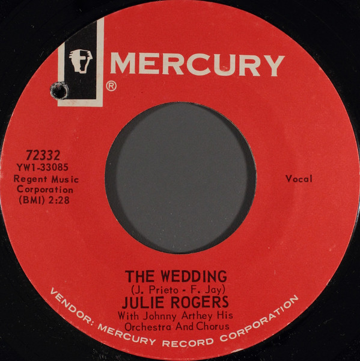

# The Wedding / Without Your Love

By Julie Rogers

## Album Data

[Discogs URL](https://www.discogs.com/release/2638590-Julie-Rogers-The-Wedding-Without-Your-Love)

- Label: Mercury
- Formats: Vinyl, 7", 45 RPM
- Genres: Pop, Vocal
- Rating: 2.71
- Released: 1964
- Year: 1964
- Release ID: 2638590
- Media condition: 
- Sleeve condition: 
- Speed: 
- Weight: 
- Notes: 

## Album Tracks

| **Position** | **Title** | **Duration** |
|--------------|-----------|--------------|
| A | **The Wedding** | 2:28 |
| B | **Without Your Love** | 2:37 |

## Artist Roles

| **Name** | **Role** |
|----------|----------|
| **Johnny Arthey** | Directed By |

