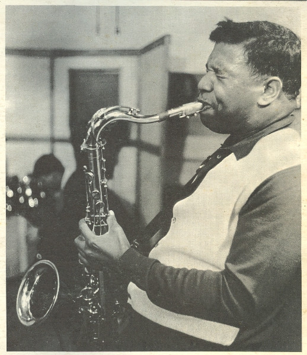

# Junior Walker

## Artist Profile

 American saxophonist, vocalist, & leader of one of Motown's signature 60's acts, Junior Walker &amp; The All Stars.
b. 14 Jun 1931 in Blythesville, Arkansas, U.S.A.
d. 23 Nov 1995 in Battle Creek, Michigan, U.S.A.

## Artist Links

- [http://en.wikipedia.org/wiki/Junior_Walker](http://en.wikipedia.org/wiki/Junior_Walker)
- [http://www.soulwalking.co.uk/Junior%20Walker.html](http://www.soulwalking.co.uk/Junior%20Walker.html)

## See also

- [Blow The House Down](Blow_The_House_Down.md)
