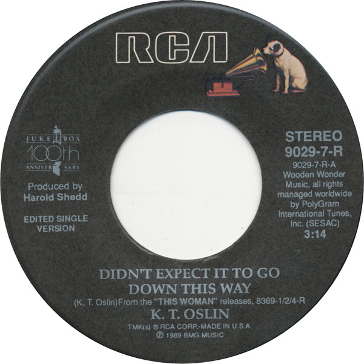

# Didn't Expect It To Go Down This Way

By K.T. Oslin

## Album Data

[Discogs URL](https://www.discogs.com/release/5690456-KT-Oslin-Didnt-Expect-It-To-Go-Down-This-Way)

- Label: RCA
- Formats: Vinyl, 7", Single, 45 RPM
- Genres: Folk, World, & Country, Country
- Rating: 4
- Released: 1989
- Year: 1989
- Release ID: 5690456
- Media condition: 
- Sleeve condition: 
- Speed: 
- Weight: 
- Notes: 

## Album Tracks

| **Position** | **Title** | **Duration** |
|--------------|-----------|--------------|
| A | **Didn't Expect It To Go Down This Way** | 3:14 |
| B | **Round The Clock Lovin'** | 4:04 |

## Artist Roles

| **Name** | **Role** |
|----------|----------|
| **Harold Shedd** | Producer |

