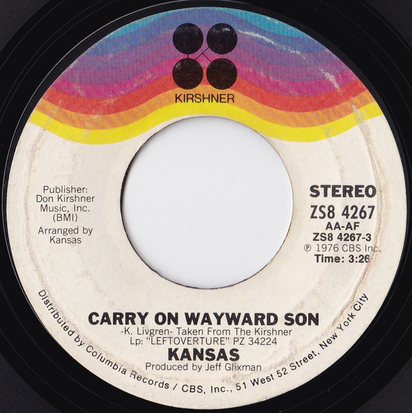

# Carry On Wayward Son

By Kansas

## Album Data

[Discogs URL](https://www.discogs.com/release/1114112-Kansas-Carry-On-Wayward-Son)

- Label: Kirshner
- Formats: Vinyl, 7", 45 RPM, Single
- Genres: Rock, Classic Rock, Prog Rock
- Rating: 4.39
- Released: 1976
- Year: 1976
- Release ID: 1114112
- Media condition: 
- Sleeve condition: 
- Speed: 
- Weight: 
- Notes: 

## Album Tracks

| **Position** | **Title** | **Duration** |
|--------------|-----------|--------------|
| A | **Carry On Wayward Son** | 3:26 |
| B | **Questions Of My Childhood** | 3:38 |

## Artist Roles

| **Name** | **Role** |
|----------|----------|
| **Kansas (2)** | Arranged By |
| **Jeff Glixman** | Producer |

