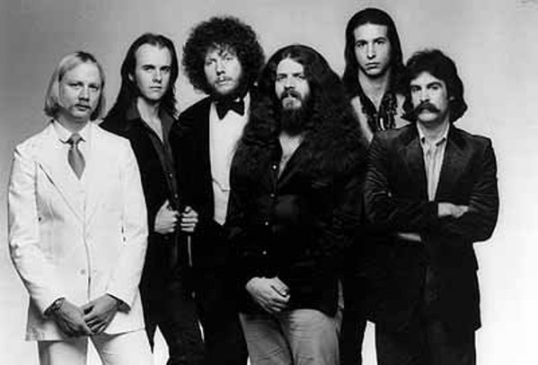

# Kansas

## Artist Profile

American progressive/hard rock band hailing from Topeka, Kansas, and formed in 1973. As of 2022, the band was composed of Phil Ehart (drums), Richard Williams (guitar), Billy Greer (bass, vocals), David Ragsdale (violin, guitar, vocals), Ronnie Platt (vocals, keyboards), and Tom Brislin (keyboards).

## Artist Links

- [https://www.kansasband.com/](https://www.kansasband.com/)
- [https://www.facebook.com/KansasBand/](https://www.facebook.com/KansasBand/)
- [https://myspace.com/kansas](https://myspace.com/kansas)
- [https://en.wikipedia.org/wiki/Kansas_%28band%29](https://en.wikipedia.org/wiki/Kansas_%28band%29)
- [https://www.imdb.com/name/nm1097675/](https://www.imdb.com/name/nm1097675/)

## See also

- [Carry On Wayward Son](Carry_On_Wayward_Son.md)
- [Leftoverture](Leftoverture.md)
