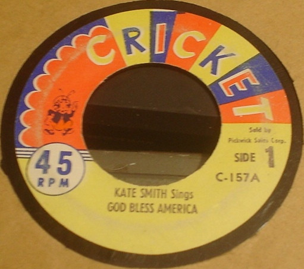

# God Bless America / My Old Kentucky Home

By Kate Smith

## Album Data

[Discogs URL](https://www.discogs.com/release/5623294-Kate-Smith-God-Bless-America-My-Old-Kentucky-Home)

- Label: Cricket (2)
- Formats: Vinyl, 7"
- Genres: Classical, Brass & Military, Children's, Brass Band
- Rating: 2
- Released: 1953
- Year: 1953
- Release ID: 5623294
- Media condition: 
- Sleeve condition: 
- Speed: 
- Weight: 
- Notes: 

## Album Tracks

| **Position** | **Title** | **Duration** |
|--------------|-----------|--------------|
| A | **God Bless America** |  |
| B | **My Old Kentucky Home** |  |

