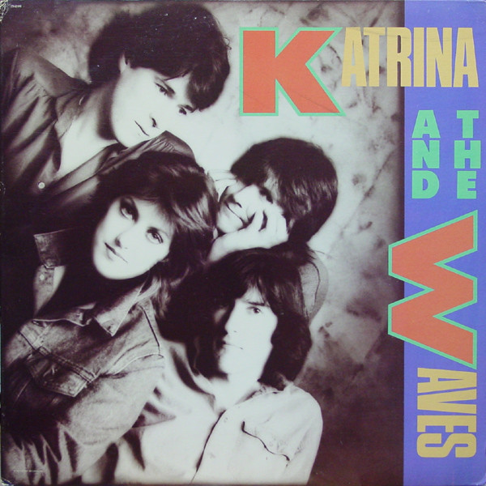

# Katrina And The Waves

By Katrina And The Waves

## Album Data

[Discogs URL](https://www.discogs.com/release/1423732-Katrina-And-The-Waves-Katrina-And-The-Waves)

- Label: Capitol Records
- Formats: Vinyl, LP, Album, Stereo
- Genres: Rock, Rock & Roll, Pop Rock
- Rating: 3.64
- Released: 1985
- Year: 1985
- Release ID: 1423732
- Media condition: 
- Sleeve condition: 
- Speed: 
- Weight: 
- Notes: 

## Album Tracks

| **Position** | **Title** | **Duration** |
|--------------|-----------|--------------|
| A1 | **Red Wine And Whisky** | 3:41 |
| A2 | **Do You Want Crying** | 3:33 |
| A3 | **Que Te Quiero** | 3:20 |
| A4 | **Machine Gun Smith** | 3:03 |
| A5 | **Cry For Me** | 4:57 |
| B1 | **Walking On Sunshine** | 3:56 |
| B2 | **Going Down To Liverpool** | 4:28 |
| B3 | **Mexico** | 3:17 |
| B4 | **The Sun Won't Shine** | 3:33 |
| B5 | **Game Of Love** | 3:17 |

## Artist Roles

| **Name** | **Role** |
|----------|----------|
| **Eamon Fitzpatrick** | Arranged By [Brass] |
| **Alex Cooper** | Backing Vocals |
| **Kimberley Rew** | Backing Vocals |
| **Vince De La Cruz** | Backing Vocals |
| **Wendy Nicholl** | Backing Vocals |
| **Vince De La Cruz** | Bass |
| **Dick Hanson** | Brass [Rumour Brass Section] |
| **John Earle** | Brass [Rumour Brass Section] |
| **Ray Beavis** | Brass [Rumour Brass Section] |
| **Manhattan Design** | Design |
| **Pat Gorman (2)** | Design |
| **Alex Cooper** | Drums |
| **Jon Goldberger** | Engineer [Assistant] |
| **Katrina Leskanich** | Lead Guitar |
| **Kimberley Rew** | Lead Guitar |
| **Carmina Gomez-Blanco** | Management |
| **Bob Ludwig** | Mastered By |
| **Scott Litt** | Mixed By, Engineer, Producer [Additional Production] |
| **Alan Chaney** | Organ |
| **Kimberley Rew** | Organ |
| **Nick Glennie-Smith** | Organ |
| **Caroline Greyshock** | Photography By |
| **Katrina And The Waves** | Producer |
| **Pat Collier** | Producer |
| **Katrina Leskanich** | Rhythm Guitar |
| **Vince De La Cruz** | Rhythm Guitar |
| **Alex Cooper** | Synthesizer |
| **Katrina Leskanich** | Vocals |
| **Kimberley Rew** | Written-By |
| **Vince De La Cruz** | Written-By |

