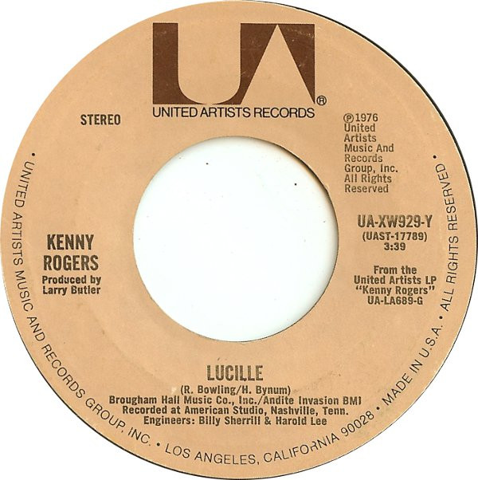

# Lucille / Till I Get It Right

By Kenny Rogers

## Album Data

[Discogs URL](https://www.discogs.com/release/1320399-Kenny-Rogers-Lucille-Till-I-Get-It-Right)

- Label: United Artists Records
- Formats: Vinyl, 7", 45 RPM, Single
- Genres: Rock, Folk, World, & Country, Pop Rock, Country
- Rating: 3.77
- Released: 1976
- Year: 1976
- Release ID: 1320399
- Media condition: 
- Sleeve condition: 
- Speed: 
- Weight: 
- Notes: 

## Album Tracks

| **Position** | **Title** | **Duration** |
|--------------|-----------|--------------|
| A | **Lucille** | 3:39 |
| B | **Till I Get It Right** | 3:01 |

## Artist Roles

| **Name** | **Role** |
|----------|----------|
| **Billy Sherrill** | Engineer |
| **Harold Lee (7)** | Engineer |
| **Bob Sowell** | Lacquer Cut By |
| **Larry Butler** | Producer |

