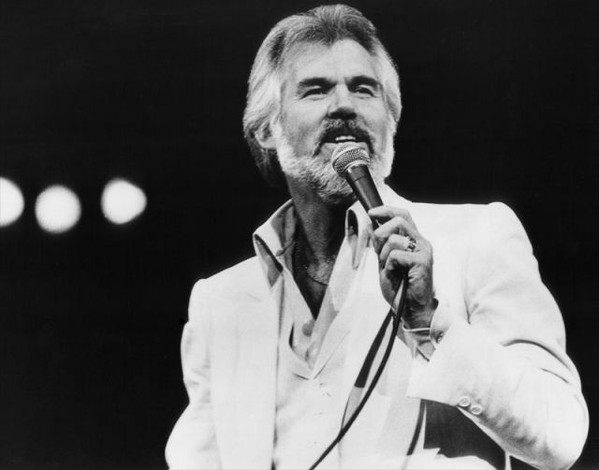

# Kenny Rogers

## Artist Profile

American country singer, bassist, producer and actor, born on August 21, 1938 in Houston, Texas, USA; died on March 20, 2020 in Sandy Springs, Georgia. He was married to Marianne Gordon from 1977 to 1993. Last married to Wanda Miller.

For the saxophone player sometimes credited with this name, please use PAN Kenny Rodgers.
For the US songwriter, see Kay Rogers.

## Artist Links

- [https://www.kennyrogers.com/](https://www.kennyrogers.com/)
- [https://www.facebook.com/KennyRogersOfficial](https://www.facebook.com/KennyRogersOfficial)
- [https://en.wikipedia.org/wiki/Kenny_Rogers](https://en.wikipedia.org/wiki/Kenny_Rogers)
- [https://www.ascap.com/repertory#ace/writer/581448922/ROGERS%20KENNETH%20R](https://www.ascap.com/repertory#ace/writer/581448922/ROGERS%20KENNETH%20R)
- [https://www.imdb.com/name/nm0737006/](https://www.imdb.com/name/nm0737006/)

## See also

- [Lucille / Till I Get It Right](Lucille_-_Till_I_Get_It_Right.md)
