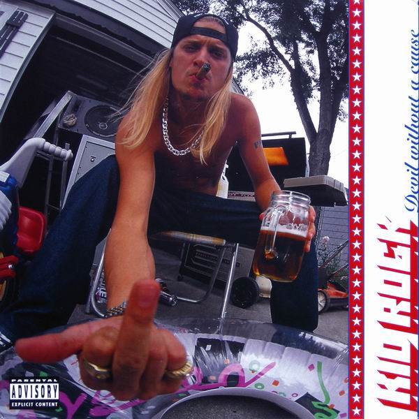

# Devil Without A Cause

By Kid Rock

## Album Data

[Discogs URL](https://www.discogs.com/release/2124393-Kid-Rock-Devil-Without-A-Cause)

- Label: Atlantic
Lava
Top Dog Records
- Formats: Vinyl, LP, Album, Limited Edition
- Genres: Hip Hop, Rock, Alternative Rock, Funk Metal
- Rating: 4.42
- Released: 1999-06-22
- Year: 1998
- Release ID: 2124393
- Media condition: 
- Sleeve condition: 
- Speed: 
- Weight: 
- Notes: 

## Album Tracks

| **Position** | **Title** | **Duration** |
|--------------|-----------|--------------|
| A1 | **Bawitdaba** | 4:27 |
| A2 | **Cowboy** | 4:17 |
| A3 | **Devil Without A Cause** | 5:32 |
| A4 | **I Am The Bullgod (Bottrill Mix)** | 4:50 |
| B5 | **Roving Gangster (Rollin')** | 4:24 |
| B6 | **Wasting Time** | 4:02 |
| B7 | **Welcome 2 The Party (Ode 2 The Old School)** | 5:14 |
| C8 | **I Got One For Ya'** | 3:37 |
| C9 | **Somebody's Gotta Feel This** | 3:09 |
| C10 | **Fist Of Rage** | 3:23 |
| C11 | **Only God Knows Why** | 5:27 |
| D12 | **F-ck Off** | 6:13 |
| D13 | **Where U At Rock** | 4:24 |
| D14 | **Black Chick, White Guy** | 7:08 |

## Artist Roles

| **Name** | **Role** |
|----------|----------|
| **Andrew Karp** | A&R |
| **Jason Flom** | A&R |
| **Misty Love** | Backing Vocals |
| **Shirley Hayden** | Backing Vocals |
| **Stefanie Eulinberg** | Band [Twisted Brown Trucker], Drums |
| **Jason Krause** | Band [Twisted Brown Trucker], Guitar [Metal] |
| **Jimmie Bones** | Band [Twisted Brown Trucker], Keyboards |
| **Kenny Olson** | Band [Twisted Brown Trucker], Lead Guitar |
| **Joe C** | Band [Twisted Brown Trucker], Rap, Performer [Tweed] |
| **Uncle Kracker** | Band [Twisted Brown Trucker], Turntables, Performer [Side-Kick] |
| **John Pinsky** | Design |
| **Al Sutton** | Engineer |
| **John Travis** | Engineer |
| **Kid Rock** | Engineer |
| **Derek Matuja** | Engineer [Assisted By] |
| **The Twisted Brown Trucker Band** | Engineer [Assisted By] |
| **Tommy Valentino (2)** | Legal |
| **Stephen Hutton** | Management [for Uppercut Management] |
| **Tony Dawsey** | Mastered By |
| **Andrew Nehra** | Musician [Our Friends Who Contributed...] |
| **Bob Ebeling** | Musician [Our Friends Who Contributed...] |
| **Chris Peters** | Musician [Our Friends Who Contributed...] |
| **DJ Swamp** | Musician [Our Friends Who Contributed...] |
| **Eminem** | Musician [Our Friends Who Contributed...] |
| **Jon Gornbein** | Musician [Our Friends Who Contributed...] |
| **Kenny Tudrick** | Musician [Our Friends Who Contributed...] |
| **Matt O'Brien (2)** | Musician [Our Friends Who Contributed...] |
| **Michael Nehra** | Musician [Our Friends Who Contributed...] |
| **Robert Bradley (4)** | Musician [Our Friends Who Contributed...] |
| **Randy G** | Photography By [Front Cover] |
| **Susan Yannetti** | Photography By [Insert - "Bubble Bath"] |
| **Joseph Cultice** | Photography By [Insert - "Cigar"] |
| **Cut Throat Adverting Agency** | Promotion [Advertising] |
| **Donna Yakes** | Technician [June Bug Control] |
| **Sue Ritchie** | Technician [June Bug Control] |
| **Tom Yakes** | Technician [June Bug Control] |

