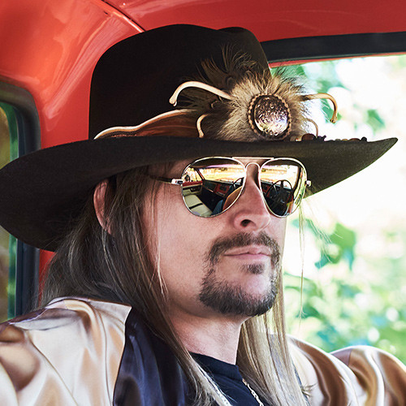

# Kid Rock

## Artist Profile

A self-proclaimed redneck from the midwestern United States, Kid Rock's mix of rap and country-influenced hard rock took him to pop stardom after his 1998 release Devil Without A Cause. He grew up near Detroit, Michigan, but in 1991 he moved to New York City to further his career. Although he had landed his first record contract in 1990, record labels weren't quite sure how to promote a white rapper who blended heavy metal and country rock. His albums The Polyfuze Method (1993) and Early Mornin' Stone Pimp (1996) were prohibited from airplay. In 2022 he released a controversial single "We the People" which states his views on wearing a mask amid COVID safety mandates.

## Artist Links

- [https://kidrock.com/](https://kidrock.com/)
- [https://www.facebook.com/kidrock](https://www.facebook.com/kidrock)
- [https://twitter.com/KidRock](https://twitter.com/KidRock)
- [https://myspace.com/kidrock](https://myspace.com/kidrock)
- [https://www.instagram.com/kidrock/](https://www.instagram.com/kidrock/)
- [https://www.youtube.com/kidrock](https://www.youtube.com/kidrock)
- [https://soundcloud.com/kidrockofficial](https://soundcloud.com/kidrockofficial)
- [https://www.imdb.com/name/nm0005376/](https://www.imdb.com/name/nm0005376/)
- [https://en.wikipedia.org/wiki/Kid_Rock](https://en.wikipedia.org/wiki/Kid_Rock)

## See also

- [Devil Without A Cause](Devil_Without_A_Cause.md)
