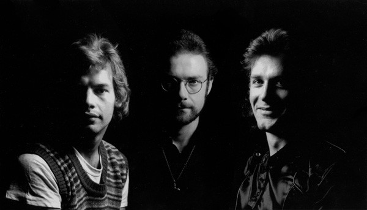

# King Crimson

## Artist Profile

One of the pioneers of the progressive rock genre. The first official rehearsal of the band was on January 13, 1969. The first line-up comprised guitarist Robert Fripp, lyricist and lighting man Peter Sinfield (who “invented” the name of the band), composer and multi-instrumentalist Ian McDonald, bassist and vocalist Greg Lake, and drummer Michael Giles. They toured extensively and released the album In The Court Of The Crimson King (An Observation By King Crimson), a seminal piece of late ’60s music. Shortly afterwards, the band split to reform again suffering continuous personnel changes for a period of two and a half years (early 1970-mid 1972), releasing three more studio albums and one recorded live, with Robert Fripp as the only remaining member.

The new King Crimson that evolved in July 1972 (featuring ex-Yes drummer Bill Bruford, ex-Family (6) and later Asia (2) bassist/vocalist John Wetton and other more transitory members) marked a turn toward a heavier progressive sound, with experimental and fusion overtones, climaxing in unique semi-improvisatory live performances. This core line-up carried on until mid-1974, when Fripp broke up the band (as he thought) for good.

In mid-1981, after a full 7 years, a newly-formed band including Robert Fripp, with Adrian Belew on vocals and guitar, Tony Levin on bass and Chapman Stick, and Bill Bruford on acoustic and electronic drums, changed its name from Discipline to King Crimson. This line-up remained intact until summer 1984, releasing three studio albums.

Ten years later (May 1994), King Crimson started rehearsing again, this time as a "double trio" including Pat Mastelotto on drums and percussion and Trey Gunn on Stick in addition to the 1980s line-up; it released two full albums and a handful of EPs through Fripp's own Discipline Global Mobile label. A process of “fractalization” led to the creation of multiple spin-off groups containing three or four King Crimson members, dubbed "ProjeKcts" One, Two, Three, Four, and X, which released live and studio sessions through DGM. Having regained the rights to the full King Crimson catalogue, DGM put out numerous other recordings from all periods of the band's existence, including "King Crimson Collectors' Club" bi-monthly releases available only to members of the label's website. In the hands of DGM, the King Crimson back catalogue (with most late additions available only on FLAC/MP3 format rather than on CD) grew enormously, making it one of the biggest for any rock group ever.

The next reincarnation of the band, jokingly dubbed the "double duo", omitted Bill Bruford and Tony Levin. Its first complete studio album was “The ConstruKction of Light” (May 2000), and the line-up carried on until the end of 2003. Since then, Tony Levin rejoined the group and Trey Gunn departed. In 2008, with the addition of Gavin Harrison the new King Crimson began and performed a 40th Anniversary Tour.

Robert Fripp stated in an August 2012 interview that he had retired from the music business, but 2014 found a new King Crimson line-up touring, including Fripp (guitar), Mel Collins (saxophones, flute), Tony Levin (basses, stick), Pat Mastelotto (drums, percussion), Gavin Harrison (drums, percussion), Jakko M. Jakszyk (vocals, guitar, flute), and William Rieflin (drums, percussion, synthesizer). In 2016 Jeremy Stacey (drums, keyboards) joined as an eighth member making the group a "double quartet".

The band toured North America and then Japan in 2021. Levin and Jakszyk had earlier said that the North America tour was probably the band's last there.

## Artist Links

- [https://www.dgmlive.com/](https://www.dgmlive.com/)
- [https://www.facebook.com/kingcrimsonofficial/](https://www.facebook.com/kingcrimsonofficial/)
- [https://twitter.com/dgmhq](https://twitter.com/dgmhq)
- [https://www.Instagram.com/dgmlive/](https://www.Instagram.com/dgmlive/)
- [https://www.youtube.com/user/DGMLiveHQ](https://www.youtube.com/user/DGMLiveHQ)
- [https://www.elephant-talk.com/wiki/ETWiki_Home](https://www.elephant-talk.com/wiki/ETWiki_Home)
- [http://www.progarchives.com/artist.asp?id=191](http://www.progarchives.com/artist.asp?id=191)
- [https://en.wikipedia.org/wiki/King_Crimson](https://en.wikipedia.org/wiki/King_Crimson)
- [https://www.imdb.com/name/nm1072743/](https://www.imdb.com/name/nm1072743/)

## See also

- [In The Court Of The Crimson King](In_The_Court_Of_The_Crimson_King.md)
