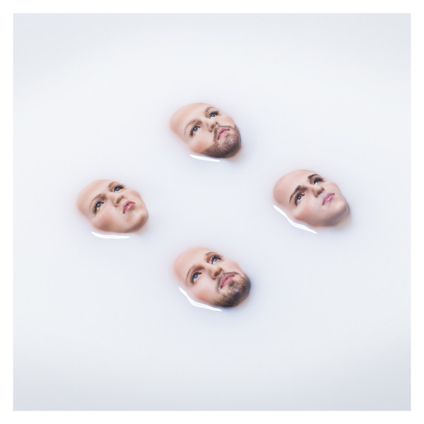

# WALLS

By Kings Of Leon

## Album Data

[Discogs URL](https://www.discogs.com/release/9187068-Kings-Of-Leon-WALLS)

- Label: RCA
- Formats: Vinyl, LP, Album
- Genres: Rock, Pop, Alternative Rock
- Rating: 4.47
- Released: 2016-10-14
- Year: 2016
- Release ID: 9187068
- Media condition: 
- Sleeve condition: 
- Speed: 
- Weight: 
- Notes: 

## Album Tracks

| **Position** | **Title** | **Duration** |
|--------------|-----------|--------------|
| A1 | **Waste A Moment** |  |
| A2 | **Reverend** |  |
| A3 | **Around The World** |  |
| A4 | **Find Me** |  |
| A5 | **Over** |  |
| A6 | **Muchacho** |  |
| B1 | **Conversation Piece** |  |
| B2 | **Eyes On You** |  |
| B3 | **Wild** |  |
| B4 | **WALLS** |  |

## Artist Roles

| **Name** | **Role** |
|----------|----------|
| **Dan Chertoff** | A&R |
| **Rebecca Lysen** | Art Direction |
| **Kim Malone** | Artwork [Doll Art] |
| **Renata Jansen** | Artwork [Doll Art] |
| **Jared Followill** | Bass, Vocals, Percussion |
| **Peter Nash (3)** | Booking [Rest Of World] |
| **Scott Clayton** | Booking [USA] |
| **Casey McGrath** | Creative Director |
| **Jessica Feldman** | Creative Director [Creative Producer] |
| **Phear Creative** | Design Concept |
| **Nathan Followill** | Drums, Vocals, Percussion |
| **Dylan Nelson** | Engineer [Assistant] |
| **Nicolas Essig** | Engineer [Assistant] |
| **Caleb Followill** | Guitar, Vocals, Percussion |
| **Matthew Followill** | Guitar, Vocals, Percussion |
| **Kent Marcus** | Legal |
| **Andy Mendelsohn** | Management |
| **Ken Levitan** | Management |
| **Beth Tyson** | Management [Financial] |
| **Jamie Cheek** | Management [Financial] |
| **Murray Chalmers PR** | Management [Press, UK] |
| **Kristen Foster** | Management [Press, USA] |
| **Ted Jensen** | Mastered By |
| **Mark Stent** | Mixed By |
| **Geoff Swan** | Mixed By [Assistant] |
| **Michael Freeman** | Mixed By [Assistant] |
| **Anthony Cairns** | Other [Additional Assistant] |
| **Brent Rawlings** | Other [Additional Assistant] |
| **Britti Himelfarb** | Other [Additional Assistant] |
| **Christopher Followill** | Other [Additional Assistant] |
| **Jay Schleusener** | Other [Additional Assistant] |
| **Jessica Windsor** | Other [Additional Assistant] |
| **Mitch Salle** | Other [Additional Assistant] |
| **Jimmy Marble (2)** | Photography By |
| **Markus Dravs** | Producer |
| **Robin Baynton** | Recorded By |
| **Caleb Followill** | Written-By |
| **Jared Followill** | Written-By |
| **Matthew Followill** | Written-By |
| **Nathan Followill** | Written-By |

