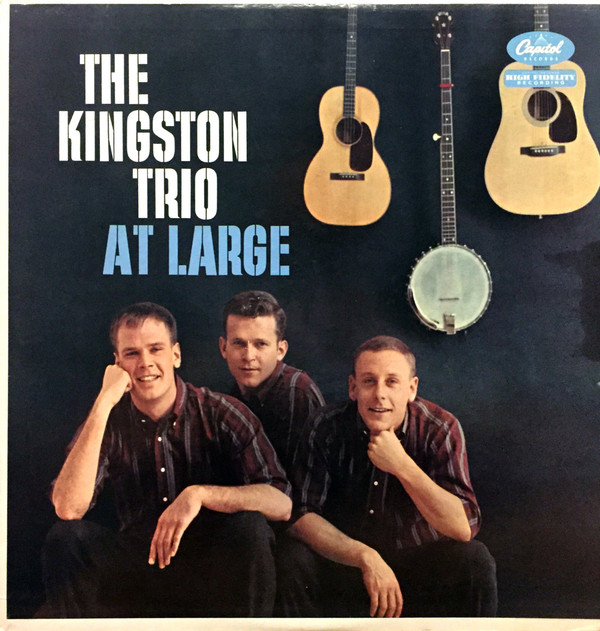

# At Large

By Kingston Trio

## Album Data

[Discogs URL](https://www.discogs.com/release/1876772-The-Kingston-Trio-At-Large)

- Label: Capitol Records
Capitol Records
- Formats: Vinyl, LP, Album, Repress, Mono
- Genres: Pop, Folk, World, & Country, Folk Rock, Ballad
- Rating: 3.45
- Released: 1959
- Year: 1959
- Release ID: 1876772
- Media condition: 
- Sleeve condition: 
- Speed: 
- Weight: 
- Notes: 

## Album Tracks

| **Position** | **Title** | **Duration** |
|--------------|-----------|--------------|
| A1 | **M.T.A.** |  |
| A2 | **All My Sorrows** |  |
| A3 | **Blow Ye Winds** |  |
| A4 | **Corey, Corey** |  |
| A5 | **The Seine** |  |
| A6 | **I Bawled** |  |
| B1 | **Good News** |  |
| B2 | **Getaway John** |  |
| B3 | **The Long Black Rifle** |  |
| B4 | **Early In The Mornin'** |  |
| B5 | **Scarlet Ribbons** |  |
| B6 | **Remember The Alamo** |  |

## Artist Roles

| **Name** | **Role** |
|----------|----------|
| **Nat Hentoff** | Liner Notes |
| **Voyle Gilmore** | Producer |

