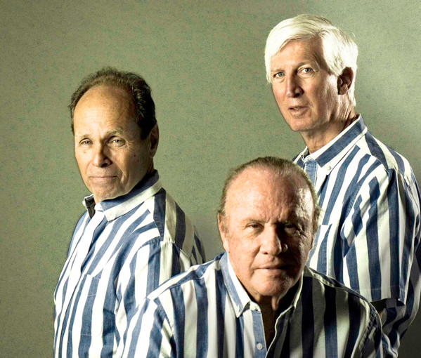

# Kingston Trio

## Artist Profile

US folk group formed in 1957. Disbanded in 1967.
Bob Shane revived the group in 1969 (the only original member at the time). Nick Reynolds, another of the originals, re-joined from 1988 to 1999.
Having gone through many iterations the group is still performing, though none of the original members are in the line-up as they have all passed on.
Following a relicensing of the name in 2017, the continuity members of the band (George Grove, Bill Zorn and Rick Dougherty) were replaced by a new lineup including Josh Reynolds (son of original member Nick Reynolds) and his cousin Mike Marvin, along with Tim Gorelangton. In 2018 Reynolds was replaced by Bob Haworth and later Don Marovich.

## Artist Links

- [http://www.kingstontrio.com/](http://www.kingstontrio.com/)
- [https://www.facebook.com/kingstontrio/](https://www.facebook.com/kingstontrio/)
- [http://en.wikipedia.org/wiki/The_Kingston_Trio](http://en.wikipedia.org/wiki/The_Kingston_Trio)
- [http://www.lazyka.com/linernotes/content/Meetthetrio_index.html](http://www.lazyka.com/linernotes/content/Meetthetrio_index.html)
- [https://www.imdb.com/name/nm1300323/](https://www.imdb.com/name/nm1300323/)

## See also

- [At Large](At_Large.md)
