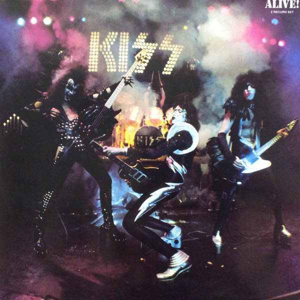

# Alive!

By Kiss

## Album Data

[Discogs URL](https://www.discogs.com/release/4530023-Kiss-Alive)

- Label: Casablanca
- Formats: Vinyl, LP, Album
- Genres: Rock, Hard Rock, Glam
- Rating: 4.25
- Released: 1975-09-10
- Year: 1975
- Release ID: 4530023
- Media condition: 
- Sleeve condition: 
- Speed: 
- Weight: 
- Notes: 

## Album Tracks

| **Position** | **Title** | **Duration** |
|--------------|-----------|--------------|
| A1 | **Deuce** | 3:32 |
| A2 | **Strutter** | 3:12 |
| A3 | **Got To Choose** | 3:35 |
| A4 | **Hotter Than Hell** | 3:11 |
| A5 | **Firehouse** | 3:42 |
| B1 | **Nothin' To Lose** | 3:23 |
| B2 | **C'mon And Love Me** | 2:52 |
| B3 | **Parasite** | 3:21 |
| B4 | **She** | 6:42 |
| C1 | **Watchin' You** | 3:37 |
| C2 | **100,000 Years** | 11:52 |
| C3 | **Black Diamond** | 5:21 |
| D1 | **Rock Bottom** | 3:08 |
| D2 | **Cold Gin** | 5:21 |
| D3 | **Rock And Roll All Nite** | 3:37 |
| D4 | **Let Me Go, Rock 'N Roll** | 5:09 |

## Artist Roles

| **Name** | **Role** |
|----------|----------|
| **Dennis Woloch** | Design |
| **Bob Ludwig** | Mastered By |
| **Ace Frehley** | Performer [Kiss] |
| **Gene Simmons** | Performer [Kiss] |
| **Paul Stanley** | Performer [Kiss] |
| **Peter Criss** | Performer [Kiss] |
| **David Spindel** | Photography By |
| **Fin Costello** | Photography By |
| **John Kelly (15)** | Photography By |
| **Mike Martineau** | Photography By |
| **Phillipe Morgan** | Photography By |
| **Stephen Levy** | Photography By |
| **Eddie Kramer** | Producer, Engineer, Mixed By |

