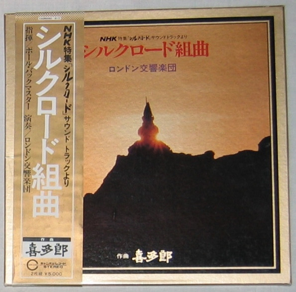

# シルクロード組曲

By Kitaro

## Album Data

[Discogs URL](https://www.discogs.com/release/2655039-%E5%96%9C%E5%A4%9A%E9%83%8E-%E3%83%AD%E3%83%B3%E3%83%89%E3%83%B3%E4%BA%A4%E9%9F%BF%E6%A5%BD%E5%9B%A3-%E3%82%B7%E3%83%AB%E3%82%AF%E3%83%AD%E3%83%BC%E3%83%89%E7%B5%84%E6%9B%B2)

- Label: Canyon
- Formats: Vinyl
Box Set, LP, Album
- Genres: Electronic, Jazz, Rock, New Age, Modern Classical, Easy Listening, Symphonic Rock
- Rating: 3.92
- Released: 1980
- Year: 1980
- Release ID: 2655039
- Media condition: 
- Sleeve condition: 
- Speed: 
- Weight: 
- Notes: 

## Album Tracks

| **Position** | **Title** | **Duration** |
|--------------|-----------|--------------|
| A1 | **Tienshan** | 5:47 |
| A2 | **Peace** | 5:25 |
| A3 | **Journey** | 4:05 |
| B1 | **Silk Road Theme** | 3:55 |
| B2 | **Drifting Sand** | 2:36 |
| B3 | **Fragrance Of Nature** | 3:20 |
| B4 | **Silk Road Fantasy** | 5:43 |
| C1 | **Time** | 4:39 |
| C2 | **Flying Celestial Nymphs** | 4:37 |
| C3 | **Silk Road Theme: Andante** | 2:54 |
| C4 | **Everlasting Road** | 4:40 |
| D1 | **Bell Tower** | 2:40 |
| D2 | **Sunset** | 5:39 |
| D3 | **Westbound** | 2:21 |
| D4 | **Magical Sand Dance** | 7:04 |

## Artist Roles

| **Name** | **Role** |
|----------|----------|
| **DeLisle Harper** | Bass |
| **Kitaro** | Composed By |
| **Paul Buckmaster** | Conductor |
| **Peter Vanhook** | Drums |
| **Atsushi Kaji** | Engineer |
| **Mike Stavrou** | Engineer |
| **Terry Murray** | Guitar |
| **Chris Cameron** | Piano |
| **Moko Nanri** | Producer |
| **Takayo Nanri** | Producer |

