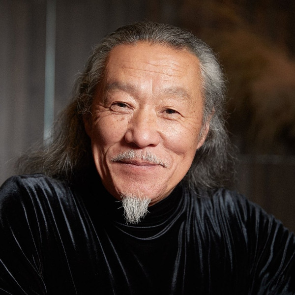

# Kitaro

## Artist Profile

Kitarō (喜多郎), born Masanori Takahashi (高橋 正則) (February 4, 1953), is a Japanese recording artist, composer, record producer, and arranger noted for his electronic-instrumental music, and is often associated with and regarded as one of the most prominent musical acts of new-age music. He is the winner of a Grammy Award for Best New Age Album (Thinking of You (1999); with a record 16 nominations in the same category) and a Golden Globe Award for the Heaven & Earth (1993) original score. The most common studios he used are Kamakura Studio, Kitaro Nagano Yasaka Atelier, Kitaro's Yasaka Studio and Sound Design Studio, Tokyo. He was part of Far East Family Band.

## Artist Links

- [https://www.domomusicgroup.com/kitaro/](https://www.domomusicgroup.com/kitaro/)
- [https://twitter.com/Kitaronetwork](https://twitter.com/Kitaronetwork)
- [https://www.youtube.com/user/kitarotv](https://www.youtube.com/user/kitarotv)
- [https://soundcloud.com/domo-records-kitaro](https://soundcloud.com/domo-records-kitaro)
- [https://myspace.com/kitaronetwork](https://myspace.com/kitaronetwork)
- [https://en.wikipedia.org/wiki/Kitar%C5%8D](https://en.wikipedia.org/wiki/Kitar%C5%8D)
- [https://ja.wikipedia.org/wiki/%E5%96%9C%E5%A4%9A%E9%83%8E](https://ja.wikipedia.org/wiki/%E5%96%9C%E5%A4%9A%E9%83%8E)
- [https://www.facebook.com/Kitaro](https://www.facebook.com/Kitaro)
- [https://www.instagram.com/official.kitaro/](https://www.instagram.com/official.kitaro/)

## See also

- [シルクロード組曲](シルクロード組曲.md)
