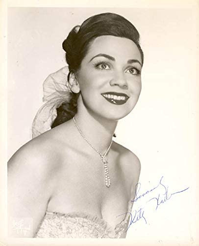

# Kitty Kallen

## Artist Profile

Kitty Kallen (born Katherine Kalinsky) Philadelphia, Pennsylvania. May 25, 1921 – January 7, 2016) was an American popular singer whose career spanned from the 1930s to the 1960s—to include the Swing era of the Big Band years, the post-WWII pop scene and the early years of rock 'n roll.

## Artist Links

- [http://en.wikipedia.org/wiki/Kitty_Kallen](http://en.wikipedia.org/wiki/Kitty_Kallen)

## See also

- [Little Things Mean A Lot](Little_Things_Mean_A_Lot.md)
