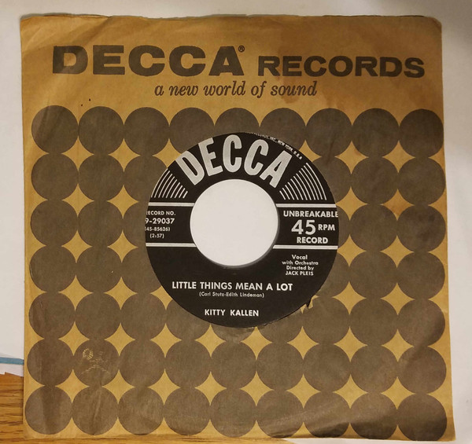

# Little Things Mean A Lot

By Kitty Kallen

## Album Data

[Discogs URL](https://www.discogs.com/release/3495088-Kitty-Kallen-Little-Things-Mean-A-Lot)

- Label: Decca
- Formats: Vinyl, 7", 45 RPM, Single
- Genres: Pop, Folk, World, & Country, Country
- Rating: 3.44
- Released: 1954
- Year: 1954
- Release ID: 3495088
- Media condition: 
- Sleeve condition: 
- Speed: 
- Weight: 
- Notes: 

## Album Tracks

| **Position** | **Title** | **Duration** |
|--------------|-----------|--------------|
| A | **Little Things Mean A Lot** | 2:57 |
| B | **I Don't Think You Love Me Anymore** | 2:20 |

