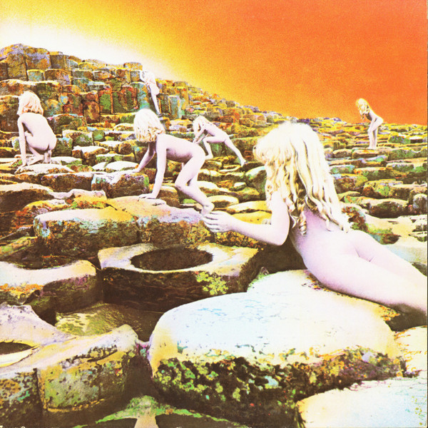

# Houses Of The Holy

By Led Zeppelin

## Album Data

[Discogs URL](https://www.discogs.com/release/6246973-Led-Zeppelin-Houses-Of-The-Holy)

- Label: Atlantic
- Formats: Vinyl, LP, Album, Reissue, Remastered, Stereo
- Genres: Rock, Blues Rock, Hard Rock, Arena Rock
- Rating: 4.65
- Released: 2014-10-28
- Year: 1973
- Release ID: 6246973
- Media condition: 
- Sleeve condition: 
- Speed: 
- Weight: 
- Notes: 

## Album Tracks

| **Position** | **Title** | **Duration** |
|--------------|-----------|--------------|
| A1 | **The Song Remains The Same** | 5:29 |
| A2 | **The Rain Song** | 7:39 |
| A3 | **Over The Hills And Far Away** | 4:50 |
| A4 | **The Crunge** | 3:17 |
| B1 | **Dancing Days** | 3:43 |
| B2 | **D'yer Mak'er** | 4:22 |
| B3 | **No Quarter** | 7:02 |
| B4 | **The Ocean** | 4:31 |

## Artist Roles

| **Name** | **Role** |
|----------|----------|
| **John Bonham** | Backing Vocals |
| **John Paul Jones** | Backing Vocals |
| **Robert Plant** | Backing Vocals |
| **John Paul Jones** | Bass |
| **John Bonham** | Drums |
| **Eddie Kramer** | Engineer |
| **George Chkiantz** | Engineer |
| **Keith Harwood** | Engineer |
| **Peter Grant** | Executive-Producer |
| **John Paul Jones** | Grand Piano, Synthesizer [Piano], Bass [Synthesised] |
| **Jimmy Page** | Guitar |
| **John Davis (4)** | Mastered By, Lacquer Cut By |
| **John Paul Jones** | Mellotron |
| **John Paul Jones** | Organ |
| **John Paul Jones** | Piano |
| **Jimmy Page** | Producer |
| **Jimmy Page** | Remastered By |
| **Hipgnosis (2)** | Sleeve |
| **John Paul Jones** | Synthesizer |
| **Robert Plant** | Vocals |

