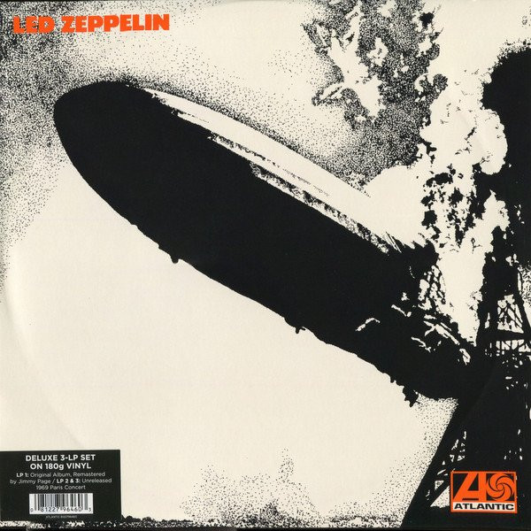

# Led Zeppelin

By Led Zeppelin

## Album Data

[Discogs URL](https://www.discogs.com/release/5743279-Led-Zeppelin-Led-Zeppelin)

- Label: Atlantic
- Formats: Vinyl
Vinyl
All Media, LP, Album, Reissue, Remastered, Stereo, LP, Album, Deluxe Edition
- Genres: Rock, Blues Rock, Hard Rock, Arena Rock
- Rating: 4.73
- Released: 2014-05-30
- Year: 1969
- Release ID: 5743279
- Media condition: 
- Sleeve condition: 
- Speed: 
- Weight: 
- Notes: 

## Album Tracks

| **Position** | **Title** | **Duration** |
|--------------|-----------|--------------|
| A1 | **Good Times Bad Times** | 2:46 |
| A2 | **Babe I'm Gonna Leave You** | 6:42 |
| A3 | **You Shook Me** | 6:28 |
| A4 | **Dazed And Confused** | 6:28 |
| B1 | **Your Time Is Gonna Come** | 4:34 |
| B2 | **Black Mountain Side** | 2:12 |
| B3 | **Communication Breakdown** | 2:30 |
| B4 | **I Can't Quit You Baby** | 4:42 |
| B5 | **How Many More Times** | 8:27 |
|  | **Live At The Olympia – Paris, France October 10, 1969** |  |
| C1 | **Good Times, Bad Times / Communication Breakdown** | 3:52 |
| C2 | **You Shook Me** | 11:56 |
| D1 | **Heartbreaker** | 3:50 |
| D2 | **Dazed And Confused** | 15:01 |
| E1 | **White Summer / Black Mountain Side** | 9:19 |
| E2 | **Moby Dick** | 9:51 |
| F1 | **I Can't Quit You Baby** | 6:41 |
| F2 | **How Many More Times** | 10:43 |

## Artist Roles

| **Name** | **Role** |
|----------|----------|
| **John Paul Jones** | Bass, Organ, Backing Vocals [Backing Vocal] |
| **Studio Fury** | Design [2014 Album Design] |
| **George Hardie** | Design [Cover Design, Original Album] |
| **John Bonham** | Drums, Timpani [Tympani], Backing Vocals [Backing Vocal] |
| **Robert Plant** | Electric Guitar, Acoustic Guitar, Pedal Steel Guitar, Backing Vocals [Backing Vocal] |
| **Glyn Johns** | Engineer [Engineered By] |
| **Peter Grant** | Executive-Producer |
| **Chris Dreja** | Photography By [Back Liner Photo, Original Album] |
| **Jean-Pierre Leloir** | Photography By [Live At The Olympia Photo] |
| **Herb Greene** | Photography By [Press Photo] |
| **Jimmy Page** | Producer [Produced By] |
| **Jimmy Page** | Remastered By |

