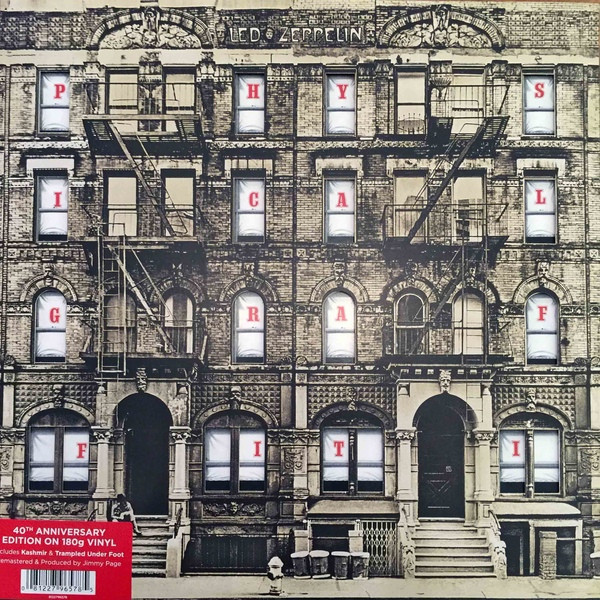

# Physical Graffiti

By Led Zeppelin

## Album Data

[Discogs URL](https://www.discogs.com/release/6696223-Led-Zeppelin-Physical-Graffiti)

- Label: Swan Song
- Formats: Vinyl, LP, Album, Reissue, Remastered, Stereo
- Genres: Rock, Hard Rock, Blues Rock
- Rating: 4.67
- Released: 2015-02-24
- Year: 1975
- Release ID: 6696223
- Media condition: 
- Sleeve condition: 
- Speed: 
- Weight: 
- Notes: 

## Album Tracks

| **Position** | **Title** | **Duration** |
|--------------|-----------|--------------|
| A1 | **Custard Pie ** | 4:15 |
| A2 | **The Rover ** | 5:39 |
| A3 | **In My Time Of Dying** | 11:08 |
| B1 | **Houses Of The Holy** | 4:04 |
| B2 | **Trampled Under Foot ** | 5:36 |
| B3 | **Kashmir ** | 8:37 |
| C1 | **In The Light** | 8:47 |
| C2 | **Bron-Yr-Aur ** | 2:06 |
| C3 | **Down By The Seaside ** | 5:15 |
| C4 | **Ten Years Gone** | 6:34 |
| D1 | **Night Flight** | 3:38 |
| D2 | **The Wanton Song** | 4:08 |
| D3 | **Boogie With Stu** | 3:52 |
| D4 | **Black Country Woman** | 4:24 |
| D5 | **Sick Again** | 4:42 |

## Artist Roles

| **Name** | **Role** |
|----------|----------|
| **AGI (4)** | Artwork [Package Concept], Design |
| **Mike Doud (2)** | Artwork [Package Concept], Design |
| **Peter Corriston** | Artwork [Package Concept], Design |
| **Maurice Tate** | Artwork [Tinting Extrordinaire] |
| **Peter Grant** | Executive-Producer |
| **David Heffernan** | Illustration [Window] |
| **John Davis (4)** | Lacquer Cut By |
| **Eddie Kramer** | Mixed By |
| **Keith Harwood** | Mixed By |
| **BP Fallon** | Photography By |
| **Elliott Erwitt** | Photography By |
| **Ray Harper** | Photography By |
| **Andy Johns** | Recorded By |
| **Eddie Kramer** | Recorded By |
| **George Chkiantz** | Recorded By |
| **Ron Nevison** | Recorded By |
| **Jimmy Page** | Remastered By, Producer |

