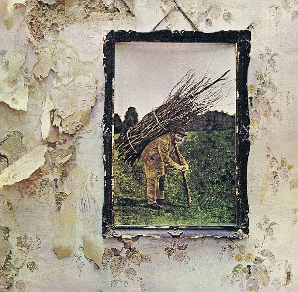

# Untitled

By Led Zeppelin

## Album Data

[Discogs URL](https://www.discogs.com/release/6224537-Led-Zeppelin-Untitled)

- Label: Atlantic
- Formats: Vinyl
Vinyl
All Media, LP, Album, Reissue, Remastered, LP, Album, Deluxe Edition
- Genres: Rock, Hard Rock, Classic Rock, Blues Rock
- Rating: 4.77
- Released: 2014-10-24
- Year: 1971
- Release ID: 6224537
- Media condition: 
- Sleeve condition: 
- Speed: 
- Weight: 
- Notes: 

## Album Tracks

| **Position** | **Title** | **Duration** |
|--------------|-----------|--------------|
|  | **Original Album** |  |
| A1 | **Black Dog** | 4:55 |
| A2 | **Rock And Roll** | 3:40 |
| A3 | **The Battle Of Evermore** | 5:51 |
| A4 | **Stairway To Heaven** | 8:02 |
| B1 | **Misty Mountain Hop** | 4:38 |
| B2 | **Four Sticks** | 4:45 |
| B3 | **Going To California** | 3:32 |
| B4 | **When The Levee Breaks** | 7:08 |
|  | **Companion Audio** |  |
| C1 | **Black Dog (Basic Track With Guitar Overdub)** | 4:34 |
| C2 | **Rock And Roll (Alternate Mix)** | 3:40 |
| C3 | **The Battle Of Evermore (Mandolin/Guitar Mix From Headley Grange)** | 4:13 |
| C4 | **Stairway To Heaven (Sunset Sound Mix)** | 8:04 |
| D1 | **Misty Mountain Hop (Alternate Mix)** | 4:45 |
| D2 | **Four Sticks (Alternate Mix)** | 4:33 |
| D3 | **Going To California (Mandolin/Guitar Mix)** | 3:34 |
| D4 | **When The Levee Breaks (Alternate U.K. Mix)** | 7:09 |

## Artist Roles

| **Name** | **Role** |
|----------|----------|
| **Studio Fury** | Design [2014 Album] |
| **Graphreaks** | Design, Coordinator [Co-ordination] |
| **Drew Griffiths** | Engineer [Additional Engineering] |
| **Peter Grant** | Executive-Producer |
| **Barrington Colby** | Illustration [Inside, 'The Hermit'] |
| **John Davis (4)** | Lacquer Cut By |
| **John Davis (4)** | Mastered By [Mastering] |
| **Sandy Denny** | Performer |
| **Jim Marshall (3)** | Photography By [Press Photo] |
| **Jimmy Page** | Producer |
| **Jimmy Page** | Remastered By |
| **Jimmy Page** | Written-By |
| **John Bonham** | Written-By |
| **John Paul Jones** | Written-By |
| **Memphis Minnie** | Written-By |
| **Robert Plant** | Written-By |

