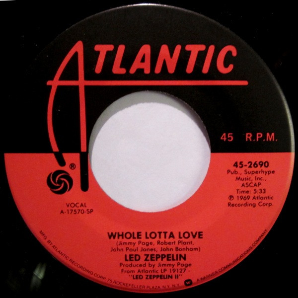

# Whole Lotta Love

By Led Zeppelin

## Album Data

[Discogs URL](https://www.discogs.com/release/3894015-Led-Zeppelin-Whole-Lotta-Love)

- Label: Atlantic
- Formats: Vinyl, 7", 45 RPM, Single
- Genres: Rock, Classic Rock, Blues Rock
- Rating: 4.39
- Released: 1969
- Year: 1969
- Release ID: 3894015
- Media condition: 
- Sleeve condition: 
- Speed: 
- Weight: 
- Notes: 

## Album Tracks

| **Position** | **Title** | **Duration** |
|--------------|-----------|--------------|
| A | **Whole Lotta Love** | 5:33 |
| B | **Living Loving Maid (She's Just A Woman)** | 2:40 |

## Artist Roles

| **Name** | **Role** |
|----------|----------|
| **Jimmy Page** | Producer |

