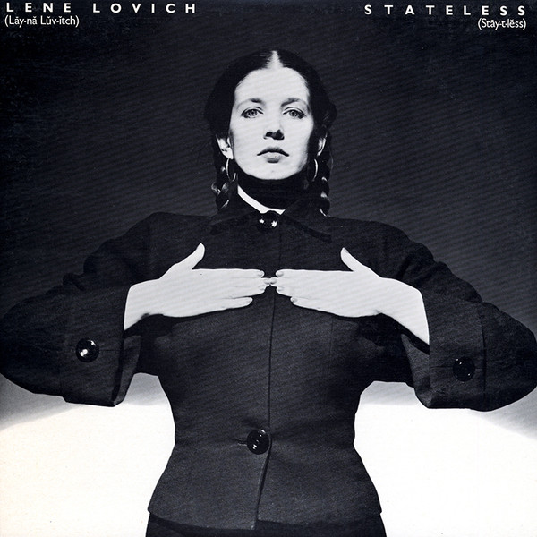

# Stateless

By Lene Lovich

## Album Data

[Discogs URL](https://www.discogs.com/release/1797693-Lene-Lovich-Stateless)

- Label: Stiff-Epic
- Formats: Vinyl, LP, Album, Stereo
- Genres: Electronic, Rock, Leftfield, New Wave, Synth-pop
- Rating: 3.93
- Released: 1979
- Year: 1978
- Release ID: 1797693
- Media condition: 
- Sleeve condition: 
- Speed: 
- Weight: 
- Notes: 

## Album Tracks

| **Position** | **Title** | **Duration** |
|--------------|-----------|--------------|
| A1 | **Home** | 3:40 |
| A2 | **Sleeping Beauty** | 3:00 |
| A3 | **Lucky Number** | 2:47 |
| A4 | **Too Tender (To Touch)** | 4:04 |
| A5 | **Say When** | 2:49 |
| B1 | **Writing On The Wall** | 3:08 |
| B2 | **Telepathy** | 2:45 |
| B3 | **Momentary Breakdown** | 3:18 |
| B4 | **I Think We're Alone Now** | 2:45 |
| B5 | **One In A 1,000,000** | 2:48 |
| B6 | **Tonight** | 4:27 |

## Artist Roles

| **Name** | **Role** |
|----------|----------|
| **Chris Morton (2)** | Artwork |
| **Ron Francois** | Bass, Percussion, Vocals |
| **Bobby Irwin** | Drums, Percussion, Vocals |
| **Aldo Bocca** | Engineer |
| **Jeremy Green** | Engineer |
| **Pete Fox** | Engineer |
| **Roger Bechirian** | Engineer, Mixed By |
| **Les Chappell** | Guitar, Percussion, Synthesizer, Vocals |
| **Brian Griffin (3)** | Photography By |
| **Nick Plytas** | Piano, Organ [Hammond] |
| **The Stateless** | Producer |
| **Roger Bechirian** | Remix |
| **Jeff Smith (9)** | Synthesizer [Polyphonic] |
| **Lene Lovich** | Vocals, Percussion [Tuned], Saxophone |

