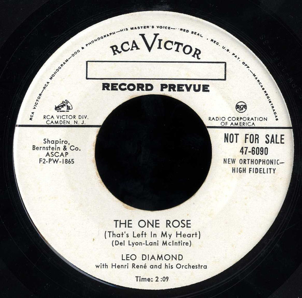

# The One Rose

By Leo Diamond

## Album Data

[Discogs URL](https://www.discogs.com/release/5180592-Leo-Diamond-With-Henri-Ren%C3%A9-And-His-Orchestra-The-One-Rose)

- Label: RCA Victor
- Formats: Vinyl, 7", 45 RPM, Single, Promo
- Genres: Pop, Vocal
- Rating: 0
- Released: null
- Year: 1955
- Release ID: 5180592
- Media condition: 
- Sleeve condition: 
- Speed: 
- Weight: 
- Notes: 

## Album Tracks

| **Position** | **Title** | **Duration** |
|--------------|-----------|--------------|
| A | **The One Rose** | 2:09 |
| B | **Land Of The Pharaohs** | 2:39 |

