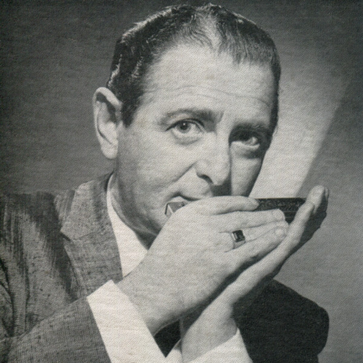

# Leo Diamond

## Artist Profile

American harmonica player and orchestra leader, born 29 June 1915 in New York City, New York, USA, died 15 September 1966 in Los Angeles, California, USA.

## Artist Links

## See also

- [The One Rose](The_One_Rose.md)
