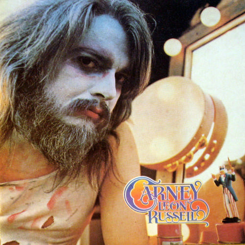

# Carney

By Leon Russell

## Album Data

[Discogs URL](https://www.discogs.com/release/1512397-Leon-Russell-Carney)

- Label: Shelter Records
- Formats: Vinyl, LP, Album
- Genres: Rock, Classic Rock
- Rating: 3.86
- Released: 1972
- Year: 1972
- Release ID: 1512397
- Media condition: 
- Sleeve condition: 
- Speed: 
- Weight: 
- Notes: 

## Album Tracks

| **Position** | **Title** | **Duration** |
|--------------|-----------|--------------|
| A1 | **Tight Rope** | 2:59 |
| A2 | **Out In The Woods** | 3:35 |
| A3 | **Me And Baby Jane** | 3:53 |
| A4 | **Manhattan Island Serenade** | 3:26 |
| A5 | **Cajun Love Song** | 3:08 |
| A6 | **Roller Derby** | 2:22 |
| B1 | **Carney** | 0:45 |
| B2 | **Acid Annapolis** | 2:51 |
| B3 | **If The Shoe Fits** | 2:23 |
| B4 | **My Cricket** | 2:56 |
| B5 | **This Masquerade** | 4:22 |
| B6 | **Magic Mirror** | 4:54 |

## Artist Roles

| **Name** | **Role** |
|----------|----------|
| **Gene Brownell** | Art Direction |
| **John C. LePrevost** | Design [Lettering] |
| **Marlin Greene** | Engineer [Muscle Shoals Sound] |
| **John Lemay** | Engineer [Paradise Studios] |
| **Peter Nicholls (4)** | Engineer [Skyhill Studios] |
| **Daniel Mayo** | Photography By |
| **Denny Cordell** | Producer |
| **Leon Russell** | Producer |

