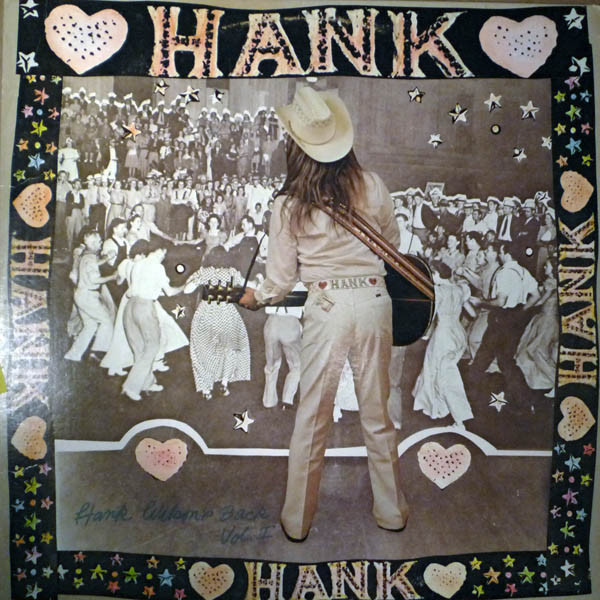

# Hank Wilson's Back Vol. I

By Leon Russell

## Album Data

[Discogs URL](https://www.discogs.com/release/1494744-Leon-Russell-Hank-Wilsons-Back-Vol-I)

- Label: Shelter Records
- Formats: Vinyl, LP, Album
- Genres: Blues, Folk, World, & Country
- Rating: 4.06
- Released: 1973
- Year: 1973
- Release ID: 1494744
- Media condition: 
- Sleeve condition: 
- Speed: 
- Weight: 
- Notes: 

## Album Tracks

| **Position** | **Title** | **Duration** |
|--------------|-----------|--------------|
| A1 | **Rollin' My Sweet Baby's Arms, Parts 1 & 2** | 4:25 |
| A2 | **She Thinks I Still Care** | 4:28 |
| A3 | **I'm So Lonesome I Could Cry** | 3:10 |
| A4 | **Sail My Ship Alone** | 2:36 |
| A5 | **Jambalaya (On The Bayou)** | 2:49 |
| A6 | **Six Pack To Go** | 2:20 |
| B1 | **Battle Of New Orleans** | 2:38 |
| B2 | **Uncle Pen** | 2:15 |
| B3 | **Am I That Easy To Forget** | 2:35 |
| B4 | **Truck Drivin' Man** | 2:11 |
| B5 | **The Window Up Above** | 3:24 |
| B6 | **Lost Highway** | 2:18 |
| B7 | **Goodnight Irene** | 4:01 |

## Artist Roles

| **Name** | **Role** |
|----------|----------|
| **Hank Wilson** | Arranged By [Musical] |
| **Charlie McCoy** | Backing Vocals |
| **David Briggs (2)** | Backing Vocals |
| **Dianne Davidson** | Backing Vocals |
| **Melba Montgomery** | Backing Vocals |
| **Millie Kirkham** | Backing Vocals |
| **Ray Edenton** | Backing Vocals |
| **Eve Babitz** | Design [Cover] |
| **Joe Mills** | Engineer |
| **Wally Traugott** | Mastered By |
| **Daniel Mayo** | Photography By [Hank's Pic] |
| **Audie Ashworth** | Producer |
| **Denny Cordell** | Producer |
| **J.J. Cale** | Producer |
| **Leon Russell** | Producer |

