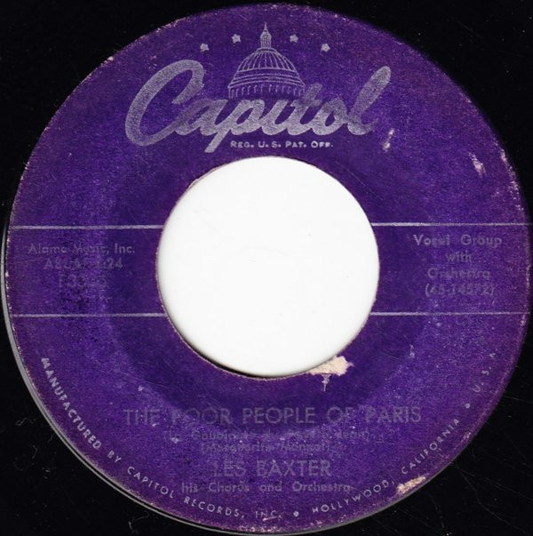

# The Poor People Of Paris (La Goualante Du Pauvre Jean)

By Les Baxter, His Chorus And Orchestra

## Album Data

[Discogs URL](https://www.discogs.com/release/5821360-Les-Baxter-His-Chorus-And-Orchestra-The-Poor-People-Of-Paris-La-Goualante-Du-Pauvre-Jean)

- Label: Capitol Records
- Formats: Vinyl, 7", Single, 45 RPM
- Genres: Jazz, Pop, Stage & Screen, Theme, Easy Listening
- Rating: 4
- Released: 1956
- Year: 1956
- Release ID: 5821360
- Media condition: 
- Sleeve condition: 
- Speed: 
- Weight: 
- Notes: 

## Album Tracks

| **Position** | **Title** | **Duration** |
|--------------|-----------|--------------|
| A | **The Poor People Of Paris (La Goualante Du Pauvre Jean)** | 2:24 |
| B | **Theme From "Helen Of Troy"** | 2:47 |

