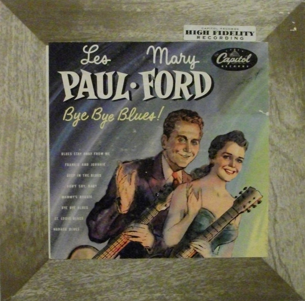

# Bye Bye Blues!

By Les Paul & Mary Ford

## Album Data

[Discogs URL](https://www.discogs.com/release/3149005-Les-Paul-Mary-Ford-Bye-Bye-Blues)

- Label: Capitol Records
Capitol Records
- Formats: Vinyl, LP, 10", Album
- Genres: Jazz, Blues
- Rating: 4.29
- Released: 1952-10-00
- Year: 1952
- Release ID: 3149005
- Media condition: 
- Sleeve condition: 
- Speed: 
- Weight: 
- Notes: 

## Album Tracks

| **Position** | **Title** | **Duration** |
|--------------|-----------|--------------|
| A1 | **Wabash Blues** |  |
| A2 | **Bye Bye Blues** |  |
| A3 | **Blues Stay Away From Me** |  |
| A4 | **Deep In The Blues** |  |
| B1 | **St. Louis Blues** |  |
| B2 | **Mammy's Boogie** |  |
| B3 | **Frankie And Johnnie** |  |
| B4 | **Don't Cry Baby** |  |

