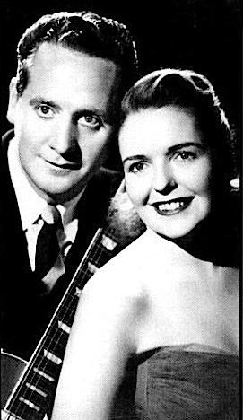

# Les Paul & Mary Ford

## Artist Profile

Popular 1950s husband-and-wife/group musical team in which Les Paul played the guitar and Mary Ford sang. In 1951 alone, they sold six million records.

## Artist Links

- [http://en.wikipedia.org/wiki/Les_Paul_and_Mary_Ford](http://en.wikipedia.org/wiki/Les_Paul_and_Mary_Ford)

## See also

- [Bye Bye Blues!](Bye_Bye_Blues!.md)
