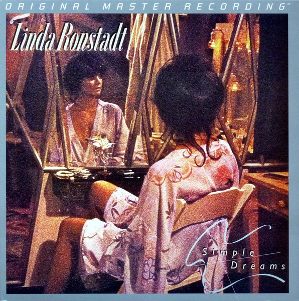

# Simple Dreams

By Linda Ronstadt

## Album Data

[Discogs URL](https://www.discogs.com/release/3793108-Linda-Ronstadt-Simple-Dreams)

- Label: Mobile Fidelity Sound Lab
- Formats: Vinyl, LP, Limited Edition, Numbered, Reissue, Remastered
- Genres: Rock, Country Rock, Soft Rock
- Rating: 4.45
- Released: 2010
- Year: 1977
- Release ID: 3793108
- Media condition: 
- Sleeve condition: 
- Speed: 
- Weight: 
- Notes: 

## Album Tracks

| **Position** | **Title** | **Duration** |
|--------------|-----------|--------------|
| A1 | **It's So Easy** | 2:27 |
| A2 | **Carmelita** | 3:07 |
| A3 | **Simple Man, Simple Dreams** | 3:12 |
| A4 | **Sorrow Lives Here** | 2:57 |
| A5 | **I Never Will Marry** | 3:12 |
| B1 | **Blue Bayou** | 3:57 |
| B2 | **Poor Poor Pitiful Me** | 3:42 |
| B3 | **Maybe I'm Right** | 3:05 |
| B4 | **Tumbling Dice** | 3:05 |
| B5 | **Old Paint** | 3:05 |

## Artist Roles

| **Name** | **Role** |
|----------|----------|
| **John Kosh** | Design, Art Direction |
| **Shawn R. Britton** | Lacquer Cut By [Runout Etchings] |
| **Shawn R. Britton** | Mastered By [Half-Speed] |
| **Dan Dugmore** | Performer |
| **Don Grolnick** | Performer |
| **Kenny Edwards** | Performer |
| **Linda Ronstadt** | Performer |
| **Rick Marotta** | Performer |
| **Waddy Wachtel** | Performer |
| **Jim Shea** | Photography By |
| **Peter Asher** | Producer [Produced By] |
| **Mark Howlett** | Recorded By [Assisted By], Mixed By [Assisted By] |
| **Val Garay** | Recorded By, Mixed By |

