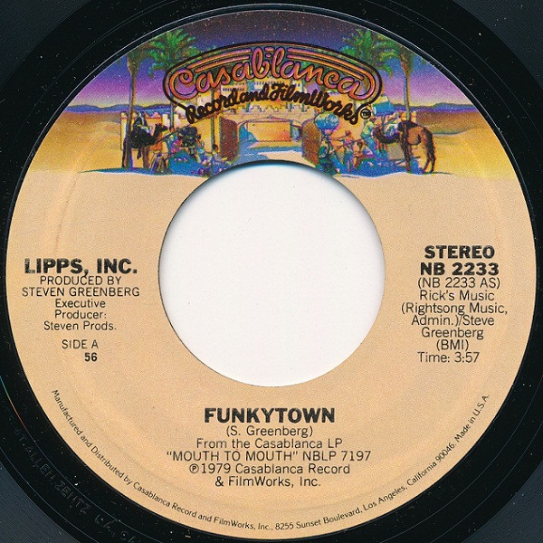

# Funkytown 

By Lipps, Inc.

## Album Data

[Discogs URL](https://www.discogs.com/release/2982823-Lipps-Inc-Funkytown-)

- Label: Casablanca
- Formats: Vinyl, 7", 45 RPM, Single, Styrene, Stereo
- Genres: Electronic, Disco
- Rating: 4
- Released: 1979
- Year: 1979
- Release ID: 2982823
- Media condition: 
- Sleeve condition: 
- Speed: 
- Weight: 
- Notes: 

## Album Tracks

| **Position** | **Title** | **Duration** |
|--------------|-----------|--------------|
| A | **Funkytown** | 3:57 |
| B | **All Night Dancing** | 3:09 |

## Artist Roles

| **Name** | **Role** |
|----------|----------|
| **Steven Productions** | Executive-Producer |
| **Steven Greenberg** | Producer |
| **Steven Greenberg** | Written-By |

