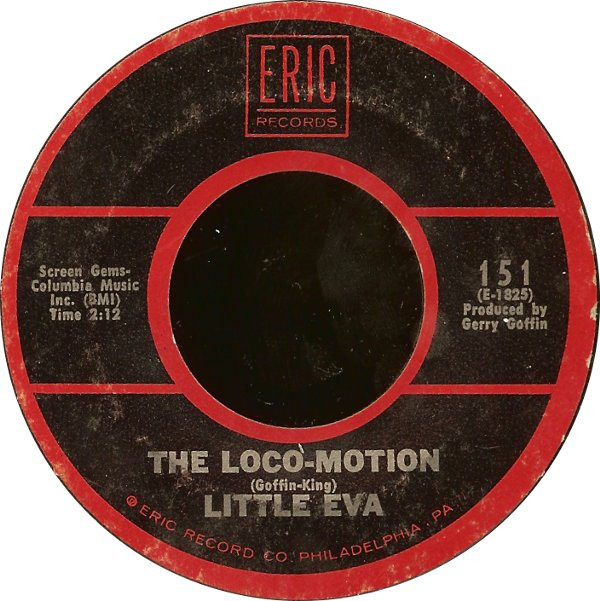

# The Loco-Motion / Keep Your Hands Off My Baby

By Little Eva

## Album Data

[Discogs URL](https://www.discogs.com/release/530430-Little-Eva-The-Loco-Motion-Keep-Your-Hands-Off-My-Baby)

- Label: Eric Records
- Formats: Vinyl, 7", 45 RPM, Reissue
- Genres: Rock, Rock & Roll
- Rating: 4.07
- Released: 1975-03-00
- Year: 1975
- Release ID: 530430
- Media condition: 
- Sleeve condition: 
- Speed: 
- Weight: 
- Notes: 

## Album Tracks

| **Position** | **Title** | **Duration** |
|--------------|-----------|--------------|
| A | **The Loco-Motion** | 2:12 |
| B | **Keep Your Hands Off My Baby** | 2:29 |

## Artist Roles

| **Name** | **Role** |
|----------|----------|
| **Gerry Goffin** | Producer |
| **Goffin And King** | Written-By |

