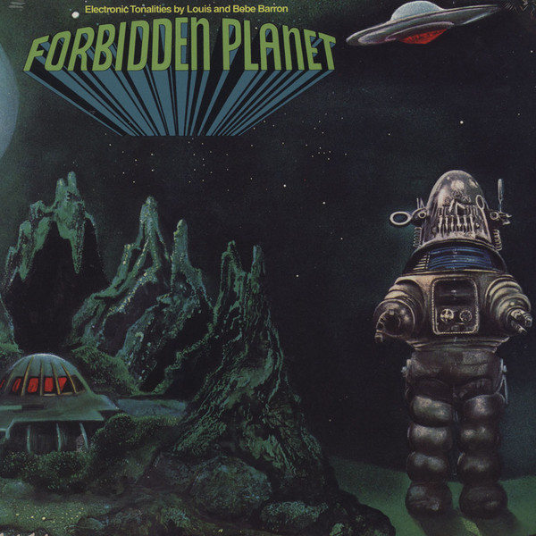

# Forbidden Planet

By Louis And Bebe Barron

## Album Data

[Discogs URL](https://www.discogs.com/release/517827-Louis-And-Bebe-Barron-Forbidden-Planet)

- Label: Small Planet Records
- Formats: Vinyl, LP, Album, Reissue
- Genres: Electronic, Stage & Screen, Soundtrack, Abstract, Noise, Ambient
- Rating: 4.67
- Released: 1978
- Year: 1976
- Release ID: 517827
- Media condition: 
- Sleeve condition: 
- Speed: 
- Weight: 
- Notes: 

## Album Tracks

| **Position** | **Title** | **Duration** |
|--------------|-----------|--------------|
| A1 | **Main Titles - Overture** | 2:20 |
| A2 | **Deceleration** | 0:50 |
| A3 | **Once Around Altair** | 1:09 |
| A4 | **The Landing** | 0:40 |
| A5 | **Flurry Of Dust - A Robot Approaches** | 1:09 |
| A6 | **A Shangri-La In The Desert / Garden With Cuddly Tiger** | 1:32 |
| A7 | **Graveyard - A Night With Two Moons** | 1:15 |
| A8 | **"Robby, Make Me A Gown"** | 1:16 |
| A9 | **An Invisible Monster Approaches** | 0:46 |
| A10 | **Robby Arranges Flowers, Zaps Monkey** | 1:17 |
| A11 | **Love At The Swimming Hole** | 3:11 |
| A12 | **Morbius' Study** | 0:37 |
| A13 | **Ancient Krell Music** | 1:47 |
| A14 | **The Mind Booster - Creation Of Matter** | 0:56 |
| B1 | **Krell Shuttle Ride And Power Station** | 2:31 |
| B2 | **Giant Footprints In The Sand** | 0:45 |
| B3 | **"Nothing Like This Claw Found In Nature!"** | 1:23 |
| B4 | **Robby, The Cook, And 60 Gallons Of Booze** | 0:56 |
| B5 | **Battle With Invisible Monster** | 2:50 |
| B6 | **"Come Back To Earth With Me"** | 1:17 |
| B7 | **The Monster Pursues - Morbius Is Overcome** | 5:45 |
| B8 | **The Homecoming** | 1:56 |
| B9 | **Overture Reprise** | 2:13 |

## Artist Roles

| **Name** | **Role** |
|----------|----------|
| **Louis And Bebe Barron** | Composed By, Producer |
| **Mary Ellen Kabat** | Edited By [Album Tape Assembly] |
| **Bill Malone** | Liner Notes |
| **Louis And Bebe Barron** | Liner Notes |
| **Bobby Hata** | Mastered By |
| **Louis Barron** | Mixed By [Remix] |
| **Adam Barron** | Other [Editorial Suggestions] |
| **Renate Druks** | Painting [Cover Painting], Art Direction |

