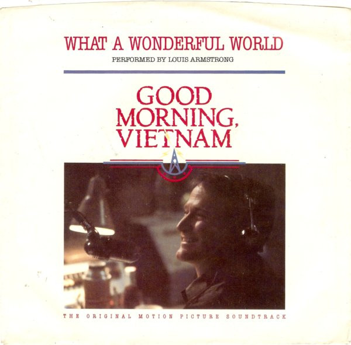

# What A Wonderful World / Game Of Love

By Louis Armstrong

## Album Data

[Discogs URL](https://www.discogs.com/release/1696882-Louis-Armstrong-Wayne-Fontana-The-Mindbenders-What-A-Wonderful-World-Game-Of-Love)

- Label: A&M Records
- Formats: Vinyl, 7", 45 RPM, Styrene, Stereo, Mono
- Genres: Jazz, Rock, Pop, Stage & Screen, Soundtrack, Rock & Roll, Cool Jazz
- Rating: 4.09
- Released: 1988
- Year: 1988
- Release ID: 1696882
- Media condition: 
- Sleeve condition: 
- Speed: 
- Weight: 
- Notes: 

## Album Tracks

| **Position** | **Title** | **Duration** |
|--------------|-----------|--------------|
| A | **What A Wonderful World** | 2:17 |
| B | **Game Of Love** | 2:06 |

## Artist Roles

| **Name** | **Role** |
|----------|----------|
| **David Anderle** | Producer |
| **Ellen Vogt** | Producer [Assistant] |

