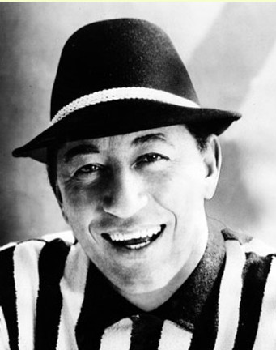

# Louis Prima

## Artist Profile

American singer, songwriter, bandleader, and trumpeter. 
Married to Keely Smith (1953-1961) and Gia Maione (1963).
Father of Lena Prima and Louis Prima Jr.
He was the voice of King Louie in Disney's The Jungle Book.

Born: December 7, 1910, New Orleans, Louisiana, USA 
Died: August 24, 1978, New Orleans, Louisiana, USA 

## Artist Links

- [https://www.louisprima.com/](https://www.louisprima.com/)
- [https://www.nola.com/entertainment_life/music/article_8c39ca8f-c822-5802-94d1-49e53131fbb5.html](https://www.nola.com/entertainment_life/music/article_8c39ca8f-c822-5802-94d1-49e53131fbb5.html)
- [https://en.wikipedia.org/wiki/Louis_Prima](https://en.wikipedia.org/wiki/Louis_Prima)
- [https://www.vocalgroupharmony.com/6ROWNEW/Angelina.htm](https://www.vocalgroupharmony.com/6ROWNEW/Angelina.htm)
- [https://www.vocalgroupharmony.com/6ROWNEW/Angelina.htm](https://www.vocalgroupharmony.com/6ROWNEW/Angelina.htm)

## See also

- [Wonderland By Night / Ol' Man Mose](Wonderland_By_Night_-_Ol_Man_Mose.md)
