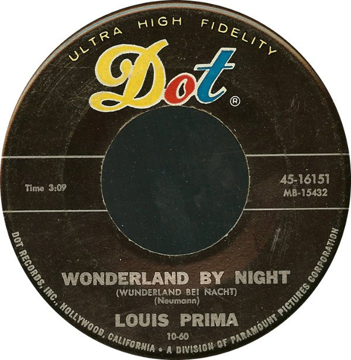

# Wonderland By Night / Ol' Man Mose

By Louis Prima

## Album Data

[Discogs URL](https://www.discogs.com/release/1323909-Louis-Prima-Wonderland-By-Night-Ol-Man-Mose)

- Label: Dot Records
- Formats: Vinyl, 7", Single
- Genres: Jazz, Swing
- Rating: 4
- Released: 1960-10-00
- Year: 1960
- Release ID: 1323909
- Media condition: 
- Sleeve condition: 
- Speed: 
- Weight: 
- Notes: 

## Album Tracks

| **Position** | **Title** | **Duration** |
|--------------|-----------|--------------|
| A | **Wonderland By Night (Wunderland Bei Nacht)** | 3:09 |
| B | **Ol' Man Mose** | 3:35 |

