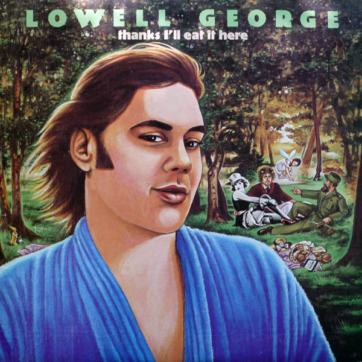

# Thanks I'll Eat It Here

By Lowell George

## Album Data

[Discogs URL](https://www.discogs.com/release/1329678-Lowell-George-Thanks-Ill-Eat-It-Here)

- Label: Warner Bros. Records
- Formats: Vinyl, LP, Album, Stereo
- Genres: Rock, Rock & Roll, Southern Rock, Funk
- Rating: 4.03
- Released: 1979-03-23
- Year: 1979
- Release ID: 1329678
- Media condition: 
- Sleeve condition: 
- Speed: 
- Weight: 
- Notes: 

## Album Tracks

| **Position** | **Title** | **Duration** |
|--------------|-----------|--------------|
| A1 | **What Do You Want The Girl To Do** | 4:45 |
| A2 | **Honest Man** | 3:43 |
| A3 | **Two Trains** | 4:32 |
| A4 | **Can't Stand The Rain** | 3:21 |
| B1 | **Cheek To Cheek** | 2:21 |
| B2 | **Easy Money** | 3:28 |
| B3 | **20 Million Things** | 2:46 |
| B4 | **Find A River** | 3:42 |
| B5 | **Himmler's Ring** | 2:25 |

## Artist Roles

| **Name** | **Role** |
|----------|----------|
| **Neon Park** | Art Direction |
| **Elizabeth George (2)** | Creative Director [Creative Guidance] |
| **Brad Kanawyer** | Design |
| **Michael Hollyfield** | Design |
| **Donn Landee** | Engineer |
| **George Massenburg** | Engineer |
| **Billy Youdelman** | Engineer [Assistant Engineer] |
| **Bruce Botnick** | Engineer [Assistant Engineer] |
| **Doug Botnick** | Engineer [Assistant Engineer] |
| **Mo Ostin** | Executive-Producer |
| **Lowell George** | Lead Vocals, Performer |
| **Bob Cavallo** | Management |
| **Darrell Johnson** | Mastered By |
| **Ray Thompson** | Mixed By |
| **Neon Park** | Painting [Cover] |
| **Arthur Gerst** | Performer |
| **Bill Payne** | Performer |
| **Bobby Bruce** | Performer |
| **Bonnie Raitt** | Performer |
| **Bruce Paulson** | Performer |
| **Chili Charles** | Performer |
| **Chuck Rainey** | Performer |
| **Darrell Leonard** | Performer |
| **David Foster** | Performer |
| **David Paich** | Performer |
| **Dean Parks** | Performer |
| **Dennis Belfield** | Performer |
| **Denny Christianson** | Performer |
| **Floyd Sneed** | Performer |
| **Fred Tackett** | Performer |
| **Gordon DeWitty** | Performer |
| **Herb Pedersen** | Performer |
| **James Newton Howard** | Performer |
| **Jeff Porcaro** | Performer |
| **Jerry Jumonville** | Performer |
| **Jim Gordon** | Performer |
| **Jim Keltner** | Performer |
| **Jim Price** | Performer |
| **Jim Self** | Performer |
| **Jimmy Greenspoon** | Performer |
| **Joel Peskin** | Performer |
| **John David Souther** | Performer |
| **John Phillips** | Performer |
| **Luis Damian** | Performer |
| **Maxayn Lewis** | Performer |
| **Maxine Dixon** | Performer |
| **Maxine Waters** | Performer |
| **Mike Baird** | Performer |
| **Nicky Hopkins** | Performer |
| **Paul Stallworth** | Performer |
| **Peggy Sandvig** | Performer |
| **Richie Hayward** | Performer |
| **Roberto Gutierrez** | Performer |
| **Ron Koss** | Performer |
| **Stephen Bruton** | Performer |
| **Steve Madaio** | Performer |
| **Bob Marks** | Photography By |
| **Elizabeth George (2)** | Photography By |
| **Nancy Goldfarb** | Photography By |
| **Lowell George** | Producer |

