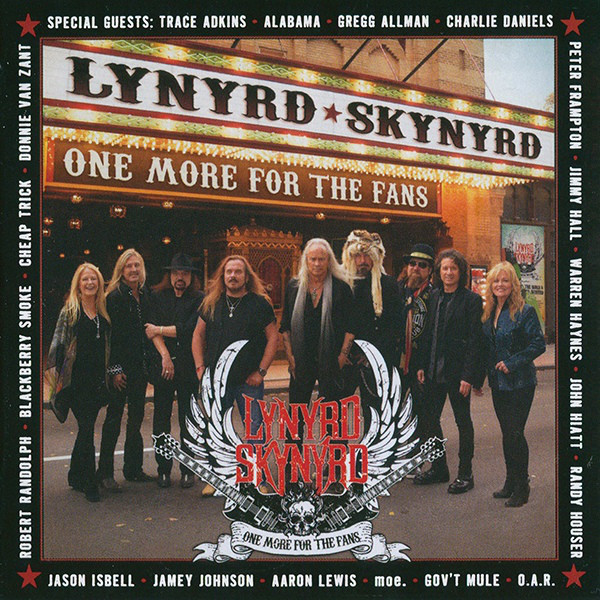

# One More For The Fans

By Lynyrd Skynyrd

## Album Data

[Discogs URL](https://www.discogs.com/release/7416413-Lynyrd-Skynyrd-One-More-For-The-Fans)

- Label: Loud & Proud Records
- Formats: Vinyl, LP
- Genres: Rock, Southern Rock
- Rating: 4.63
- Released: 2015
- Year: 2015
- Release ID: 7416413
- Media condition: 
- Sleeve condition: 
- Speed: 
- Weight: 
- Notes: 

## Album Tracks

| **Position** | **Title** | **Duration** |
|--------------|-----------|--------------|
| A1 | **Whiskey Rock A Roller ** | 4:39 |
| A2 | **You Got That Right ** | 5:04 |
| A3 | **Saturday Night Special** | 4:50 |
| A4 | **Workin’ For MCA** | 5:26 |
| B1 | **Don’t Ask Me No Questions** | 4:12 |
| B2 | **Gimme Back My Bullets** | 3:48 |
| B3 | **The Ballad Of Curtis Loew** | 5:20 |
| C1 | **Simple Man** | 8:59 |
| C2 | **That Smell ** | 7:38 |
| C3 | **Four Walls Of Raiford** | 5:22 |
| D1 | **I Know A Little** | 3:35 |
| D2 | **Call Me The Breeze** | 5:36 |
| D3 | **What’s Your Name** | 3:56 |
| D4 | **Down South Jukin’** | 4:10 |
| E1 | **Gimme Three Steps** | 4:42 |
| E2 | **Tuesday’s Gone** | 6:58 |
| E3 | **Travelin’ Man** | 4:21 |
| F1 | **Free Bird ** | 13:59 |
| F2 | **Sweet Home Alabama** | 3:32 |

## Artist Roles

| **Name** | **Role** |
|----------|----------|
| **Don Was** | Directed By |
| **Keith Wortman** | Executive-Producer |
| **Ken Levitan** | Executive-Producer |
| **Ross Schilling** | Executive-Producer |
| **Keith Wortman** | Other [Creator] |

