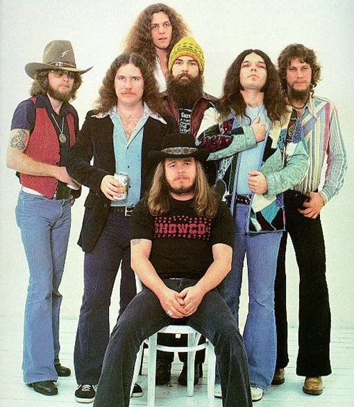

# Lynyrd Skynyrd

## Artist Profile

Lynyrd Skynyrd (pronounced /ˌlɛnərd ˈskɪnərd/ len-ərd-skin-ərd) is an American rock band best known for popularizing the Southern hard rock genre during the 1970s. Originally formed in 1964 as the "Noble Five" in Jacksonville, Florida, the band rose to worldwide recognition on the basis of its driving live performances and signature tunes "Sweet Home Alabama," and "Free Bird." At the peak of their success, three members died in an airplane crash in 1977, putting an abrupt end to the band's most popular incarnation.
Surviving members re-formed in 1987 for a reunion tour with lead singer Ronnie Van Zant's younger brother Johnny as frontman. A version of the band continues to tour and record, with only Gary Rossington of its original members remaining as of 2012. Lynyrd Skynyrd was inducted into the Rock and Roll Hall of Fame on March 13, 2006.

## Artist Links

- [https://www.lynyrdskynyrd.com/](https://www.lynyrdskynyrd.com/)
- [https://myspace.com/lynyrdskynyrd](https://myspace.com/lynyrdskynyrd)
- [http://www.lynyrdskynyrdhistory.com/](http://www.lynyrdskynyrdhistory.com/)
- [https://www.facebook.com/LynyrdSkynyrd](https://www.facebook.com/LynyrdSkynyrd)
- [https://twitter.com/skynyrd](https://twitter.com/skynyrd)
- [https://www.youtube.com/user/SkynyrdOfficial](https://www.youtube.com/user/SkynyrdOfficial)
- [https://en.wikipedia.org/wiki/Lynyrd_Skynyrd](https://en.wikipedia.org/wiki/Lynyrd_Skynyrd)

## See also

- [One More For The Fans](One_More_For_The_Fans.md)
- [(Pronounced 'Lĕh-'nérd 'Skin-'nérd)](Pronounced_Lĕh-nérd_Skin-nérd.md)
