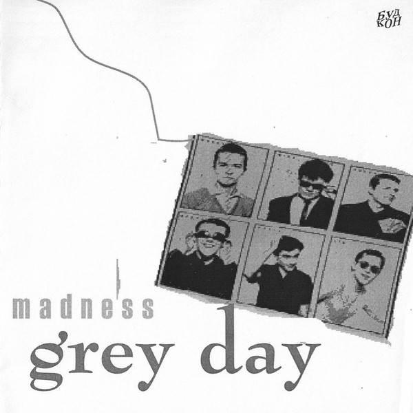

# Grey Day

By Madness

## Album Data

[Discogs URL](https://www.discogs.com/release/401158-Madness-Grey-Day)

- Label: Stiff Records
- Formats: Vinyl, 7", 45 RPM, Single
- Genres: Rock, Pop, Ska
- Rating: 4.21
- Released: 1981
- Year: 1981
- Release ID: 401158
- Media condition: 
- Sleeve condition: 
- Speed: 
- Weight: 
- Notes: 

## Album Tracks

| **Position** | **Title** | **Duration** |
|--------------|-----------|--------------|
| A | **Grey Day** | 3:40 |
| B | **Memories** | 2:25 |

## Artist Roles

| **Name** | **Role** |
|----------|----------|
| **Arun Chakraverty** | Lacquer Cut By |

