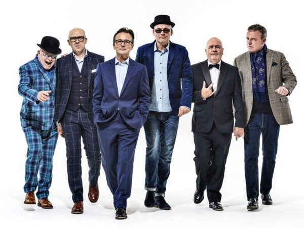

# Madness

## Artist Profile

Madness are an English ska band from Camden Town, London, that formed in 1976. One of the most prominent bands of the late 1970s and early 1980s 2 Tone ska revival, they continue to perform with their most recognised line-up of seven members.

Madness achieved most of their success in the early to mid 1980s. Both Madness and UB40 spent 214 weeks on the UK singles charts over the course of the decade, holding the record for most weeks spent by a group in the 1980s UK singles charts. However, Madness achieved this in a shorter time period (1980–1986).

Briefly, in 1988, some members spun off into The Madness.

## Artist Links

- [https://www.madness.co.uk/](https://www.madness.co.uk/)
- [https://www.facebook.com/madnessofficial](https://www.facebook.com/madnessofficial)
- [https://twitter.com/MadnessNews](https://twitter.com/MadnessNews)
- [https://instagram.com/madnessband/](https://instagram.com/madnessband/)
- [https://www.youtube.com/user/MadtubeMTV](https://www.youtube.com/user/MadtubeMTV)
- [https://myspace.com/madnessofficial](https://myspace.com/madnessofficial)
- [https://en.wikipedia.org/wiki/Madness_(band)](https://en.wikipedia.org/wiki/Madness_(band))

## See also

- [Grey Day](Grey_Day.md)
