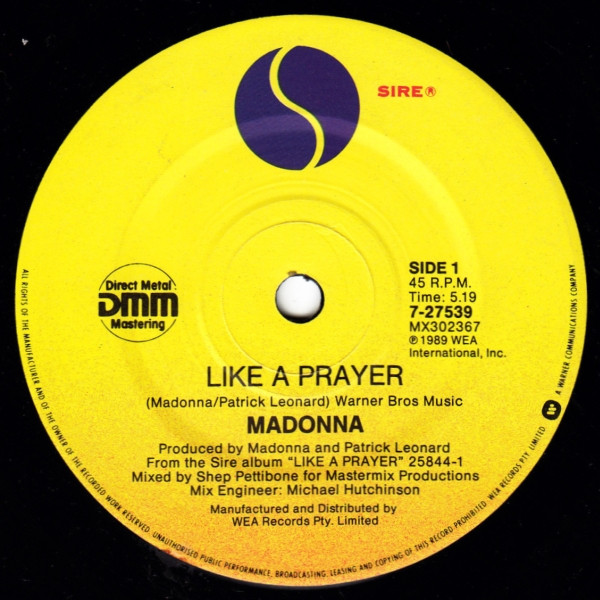

# Like A Prayer

By Madonna

## Album Data

[Discogs URL](https://www.discogs.com/release/8772567-Madonna-Like-A-Prayer)

- Label: Sire
Sire
- Formats: Vinyl, LP, Album, Reissue
- Genres: Electronic, Synth-pop
- Rating: 4.72
- Released: 2016-07-12
- Year: 1989
- Release ID: 8772567
- Media condition: 
- Sleeve condition: 
- Speed: 
- Weight: 
- Notes: 

## Album Tracks

| **Position** | **Title** | **Duration** |
|--------------|-----------|--------------|
| A1 | **Like A Prayer** |  |
| A2 | **Express Yourself** |  |
| A3 | **Love Song** |  |
| A4 | **Till Death Do Us Part** |  |
| A5 | **Promise To Try** |  |
| B1 | **Cherish** |  |
| B2 | **Dear Jessie** |  |
| B3 | **Oh Father** |  |
| B4 | **Keep It Together** |  |
| B5 | **Spanish Eyes** |  |
| B6 | **Act Of Contrition** |  |

## Artist Roles

| **Name** | **Role** |
|----------|----------|
| **Bruce Gaitsch** | Acoustic Guitar |
| **Chuck Findley** | Arranged By [Horns] |
| **Bill Meyers** | Arranged By [Strings], Conductor [Strings] |
| **Jeri Heiden** | Art Direction |
| **Donna de Lory** | Backing Vocals |
| **Lynne Fiddmont** | Backing Vocals |
| **Madonna** | Backing Vocals |
| **Marcos Loya** | Backing Vocals |
| **Marilyn Martin** | Backing Vocals |
| **Nadirah Ali** | Backing Vocals |
| **Niki Haris** | Backing Vocals |
| **Rose Banks** | Backing Vocals |
| **The Andraé Crouch Choir** | Backing Vocals |
| **Guy Pratt** | Bass |
| **Randy Jackson (2)** | Bass |
| **Chuck Findley** | Brass |
| **David Boruff** | Brass |
| **Dick Hyde** | Brass |
| **Steve Madaio** | Brass |
| **Larry Corbett** | Cello [Solo] |
| **Geary Lanier** | Clavinet |
| **Patrick Leonard** | Clavinet |
| **Suzie Katayama** | Concertmaster |
| **Margo Chase** | Design [Logo Design] |
| **Jeff Porcaro** | Drums |
| **John Robinson (2)** | Drums |
| **Jonathan Moffett** | Drums |
| **Michael Vail Blum** | Engineer [Additional] |
| **Bob Salcedo** | Engineer [Assistant] |
| **Joe Schiff** | Engineer [Assistant] |
| **Stacy Baird** | Engineer [Assistant] |
| **Eddie Miller** | Engineer [At Paisley Park] |
| **Heidi Hanschu** | Engineer [At Paisley Park] |
| **Stephen Shelton (2)** | Engineer [At Paisley Park] |
| **Joe Meyer** | French Horn |
| **Richard Todd** | French Horn |
| **Bruce Gaitsch** | Guitar |
| **Chester Kamen** | Guitar |
| **Dann Huff** | Guitar |
| **David Williams (4)** | Guitar |
| **Marcos Loya** | Guitar [Requinto] |
| **Chris Parmenidis** | Lacquer Cut By |
| **Joe Porcaro** | Marimba |
| **Bob Ludwig** | Mastered By |
| **Bill Bottrell** | Mixed By, Engineer |
| **Luis Conte** | Percussion |
| **Paulinho Da Costa** | Percussion |
| **Herb Ritts** | Photography By |
| **Patrick Leonard** | Piano [Acoustic], Performer [B3] |
| **Madonna** | Producer |
| **Patrick Leonard** | Producer |
| **Prince** | Producer |
| **Stephen Bray** | Producer |
| **Ivy Skoff** | Producer [Coordinator] |
| **Jai Winding** | Synthesizer |
| **Patrick Leonard** | Synthesizer |
| **Stephen Bray** | Synthesizer |
| **Madonna** | Synthesizer [Additional] |
| **Sandra Crouch** | Tambourine [Spanish] |
| **Harry McCarthy** | Technician [Drums] |
| **John Good** | Technician [Drums] |

