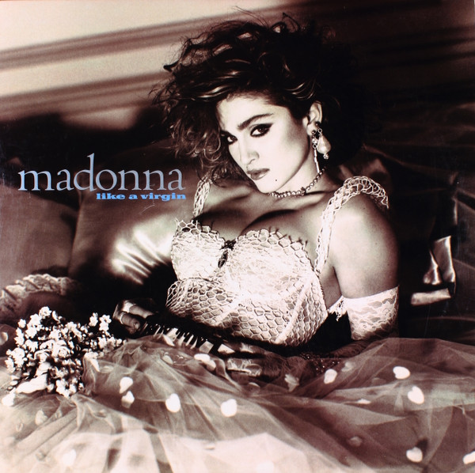

# Like A Virgin

By Madonna

## Album Data

[Discogs URL](https://www.discogs.com/release/8626357-Madonna-Like-A-Virgin)

- Label: Sire
Sire
- Formats: Vinyl, LP, Album, Club Edition
- Genres: Electronic, Pop, Synth-pop
- Rating: 4.09
- Released: 1984-11-12
- Year: 1984
- Release ID: 8626357
- Media condition: 
- Sleeve condition: 
- Speed: 
- Weight: 
- Notes: 

## Album Tracks

| **Position** | **Title** | **Duration** |
|--------------|-----------|--------------|
| A1 | **Material Girl** | 4:04 |
| A2 | **Angel** | 3:57 |
| A3 | **Like A Virgin** | 3:39 |
| A4 | **Over And Over** | 4:13 |
| A5 | **Love Don't Live Here Anymore** | 4:51 |
| B1 | **Dress You Up** | 4:02 |
| B2 | **Shoo-Bee-Doo** | 5:18 |
| B3 | **Pretender** | 4:31 |
| B4 | **Stay** | 4:09 |

## Artist Roles

| **Name** | **Role** |
|----------|----------|
| **Jeffrey Kent Ayeroff** | Art Direction |
| **Paula Greif** | Art Direction |
| **Jeri McManus** | Art Direction, Design |
| **Curtis King** | Backing Vocals |
| **Frank Simms** | Backing Vocals |
| **George Simms** | Backing Vocals |
| **Madonna** | Backing Vocals |
| **Bernard Edwards** | Bass |
| **Jimmy Bralower** | Drum Programming [Linn, Simmons] |
| **Tony Thompson (2)** | Drums |
| **Weisner-DeMann Entertainment** | Management |
| **Steven Meisel** | Photography By |
| **Nile Rodgers** | Producer, Guitar |
| **Rob Sabino** | Synthesizer [Assorted] |
| **Rob Sabino** | Synthesizer [Bass] |
| **Madonna** | Written-By |
| **Stephen Bray** | Written-By |

