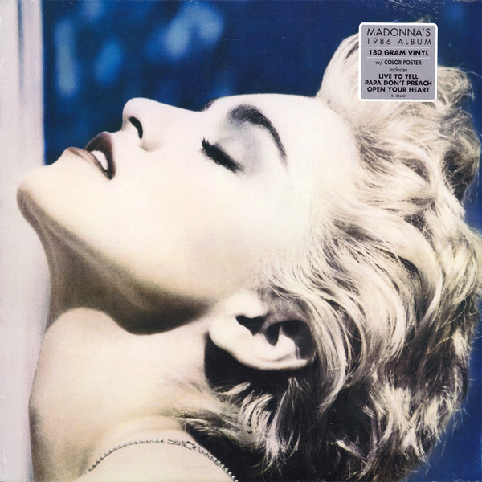

# True Blue

By Madonna

## Album Data

[Discogs URL](https://www.discogs.com/release/8772579-Madonna-True-Blue)

- Label: Sire
- Formats: Vinyl, LP, Album, Reissue
- Genres: Electronic, Pop, Synth-pop
- Rating: 4.58
- Released: 2016-07-12
- Year: 1986
- Release ID: 8772579
- Media condition: 
- Sleeve condition: 
- Speed: 
- Weight: 
- Notes: 

## Album Tracks

| **Position** | **Title** | **Duration** |
|--------------|-----------|--------------|
| A1 | **Papa Don't Preach** |  |
| A2 | **Open Your Heart** |  |
| A3 | **White Heat** |  |
| A4 | **Live To Tell** |  |
| B1 | **Where's The Party** |  |
| B2 | **True Blue** |  |
| B3 | **La Isla Bonita** |  |
| B4 | **Jimmy Jimmy** |  |
| B5 | **Love Makes The World Go Round** |  |

## Artist Roles

| **Name** | **Role** |
|----------|----------|
| **John Putnam** | Acoustic Guitar |
| **Bill Meyers** | Arranged By [Strings] |
| **Jeffrey Kent Ayeroff** | Art Direction |
| **Jeri McManus** | Art Direction |
| **David Williams (4)** | Backing Vocals |
| **Edie Lehmann** | Backing Vocals |
| **Jackie Jackson** | Backing Vocals |
| **Jonathan Moffett** | Backing Vocals |
| **Keithen Carter** | Backing Vocals |
| **Madonna** | Backing Vocals |
| **Richard Marx** | Backing Vocals |
| **Siedah Garrett** | Backing Vocals |
| **Jeri McManus** | Design |
| **Patrick Leonard** | Drum Programming |
| **Stephen Bray** | Drum Programming |
| **Jonathan Moffett** | Drums |
| **Patrick Leonard** | Drums |
| **Stephen Bray** | Drums |
| **Bruce Gaitsch** | Electric Guitar |
| **John Putnam** | Electric Guitar |
| **Michael Verdick** | Engineer, Mixed By |
| **Bruce Gaitsch** | Guitar |
| **Dann Huff** | Guitar |
| **David Williams (4)** | Guitar |
| **Paul Jackson Jr.** | Guitar |
| **Patrick Leonard** | Keyboards |
| **Stephen Bray** | Keyboards |
| **Fred Zarr** | Keyboards [Additional] |
| **Patrick Leonard** | Keyboards [Additional] |
| **Freddy Demann** | Management |
| **Weisner-DeMann Entertainment** | Management |
| **Dan Nebenzal** | Mixed By [Assistant] |
| **Jonathan Moffett** | Percussion |
| **Paulinho Da Costa** | Percussion |
| **Herb Ritts** | Photography By |
| **Madonna** | Producer |
| **Patrick Leonard** | Producer |
| **Stephen Bray** | Producer |
| **Bruce Gaitsch** | Rhythm Guitar |
| **David Williams (4)** | Rhythm Guitar |
| **David Boruff** | Saxophone |

