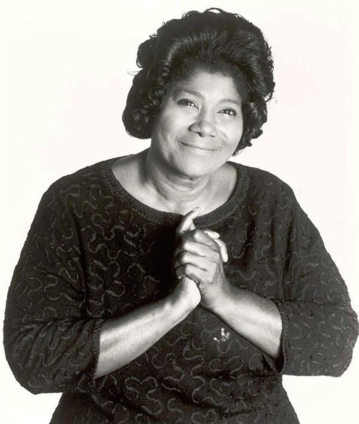

# Mahalia Jackson

## Artist Profile

Mahalia Jackson was an American gospel singer, born 26 October 1911 in New Orleans, Louisiana, USA and died 27 January 1972 in Evergreen Park, Chicago, Illinois, USA. She widely is considered one of the most influential vocalists of the 20th century. She was credited as being the “Queen of Gospel.” With a career spanning 40 years, Jackson was integral to the development and spread of gospel blues in black churches throughout the U.S. During a time when racial segregation was pervasive in American society, she met considerable and unexpected success in a recording career, selling an estimated 22 million records and performing in front of integrated and secular audiences in concert halls around the world. She was Inducted into Rock And Roll Hall of Fame in 1997.

## Artist Links

- [https://en.wikipedia.org/wiki/Mahalia_Jackson](https://en.wikipedia.org/wiki/Mahalia_Jackson)
- [https://www.imdb.com/name/nm0413810/](https://www.imdb.com/name/nm0413810/)
- [https://www.biography.com/musician/mahalia-jackson](https://www.biography.com/musician/mahalia-jackson)
- [https://www.britannica.com/biography/Mahalia-Jackson](https://www.britannica.com/biography/Mahalia-Jackson)

## See also

- [Silent Night, Holy Night / Mary's Little Boy Chile](Silent_Night__Holy_Night_-_Marys_Little_Boy_Chile.md)
