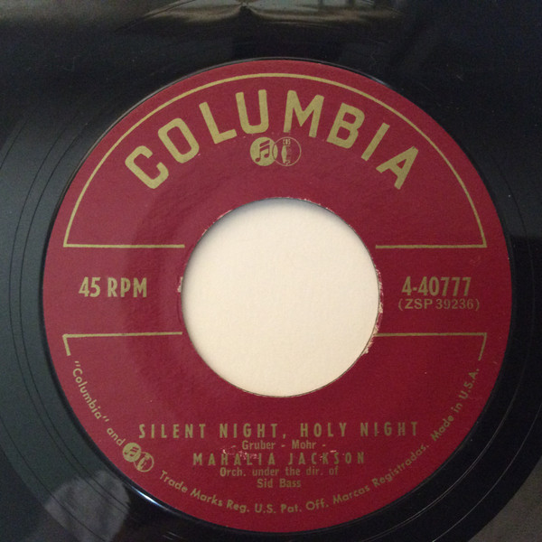

# Silent Night, Holy Night / Mary's Little Boy Chile

By Mahalia Jackson

## Album Data

[Discogs URL](https://www.discogs.com/release/9763343-Mahalia-Jackson-Silent-Night-Holy-Night-Marys-Little-Boy-Chile)

- Label: Columbia
- Formats: Vinyl, 7", 45 RPM, Single
- Genres: Funk / Soul, Folk, World, & Country, Gospel
- Rating: 0
- Released: 1956
- Year: 0
- Release ID: 9763343
- Media condition: 
- Sleeve condition: 
- Speed: 
- Weight: 
- Notes: 

## Album Tracks

| **Position** | **Title** | **Duration** |
|--------------|-----------|--------------|
| A | **Silent Night, Holy Night** |  |
| B | **Mary's Little Boy Chile** |  |

## Artist Roles

| **Name** | **Role** |
|----------|----------|
| **Sid Bass** | Conductor |

